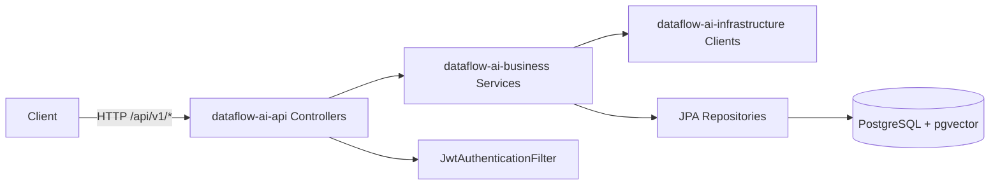

# DataFlow AI — 架构与功能文档

> 版本基于代码库当前实现（Spring Boot 3.2.3）。  
> 所有业务 API 统一前缀：`http://127.0.0.1:7681/api`（`server.servlet.context-path=/api`）。  
> **API 章节更新**：2026-05-22（与 Controller 源码对齐，共 43 个 HTTP 端点）。

---

## 目录

1. [项目概述](#1-项目概述)
2. [技术栈](#2-技术栈)
3. [模块架构](#3-模块架构)
4. [分层与依赖](#4-分层与依赖)
5. [核心功能](#5-核心功能)
6. [数据流执行引擎](#6-数据流执行引擎)
7. [安全与认证](#7-安全与认证)
8. [数据库设计](#8-数据库设计)
9. [配置说明](#9-配置说明)
10. [统一响应格式](#10-统一响应格式)
11. [REST API 详细说明](#11-rest-api-详细说明)
12. [Actuator 与文档端点](#12-actuator-与文档端点)
13. [附录：枚举与值对象](#13-附录枚举与值对象)

---

## 1. 项目概述

**DataFlow AI** 是一个基于 AI 的数据转换平台：用户通过自然语言描述转换意图，系统结合大语言模型（LLM）与向量检索生成/推荐数据处理节点，并支持将 Source → Transform → Sink 组装为 **Pipeline** 进行执行。

主要能力：

| 能力 | 说明 |
|------|------|
| AI 辅助转换 | 自然语言生成 `Transform` 节点，并持久化到 `ai_helpers` |
| 相似指令检索 | 基于 pgvector 的余弦相似度搜索历史指令 |
| 用户反馈闭环 | accept / modify / reject 反馈用于优化历史记录 |
| 数据源管理 | 多类型数据源，连接配置加密存储 |
| Pipeline 编排 | JSONB 存储 source/transforms/sink/schedule |
| 异步执行 | Pipeline 触发后异步执行，支持取消与统计 |
| 权限与脱敏 | 字段/行级权限模型（引擎侧 `PermissionEngine`） |

---

## 2. 技术栈

| 类别 | 技术 | 版本/说明 |
|------|------|-----------|
| 语言 | Java | 17 |
| 框架 | Spring Boot | 3.2.3 |
| 云组件 | Spring Cloud | 2023.0.0 |
| 数据库 | PostgreSQL + pgvector | JDBC 42.7.2，向量 0.1.4 |
| 持久化 | Spring Data JPA | JSONB 列 + 自定义 AttributeConverter |
| 安全 | Spring Security + JWT | jjwt 0.11.5 |
| API 文档 | Knife4j / OpenAPI 3 | 4.5.0 |
| 工具 | Lombok、MapStruct、Hutool | — |

---

## 3. 模块架构

```
dataflow-ai/                          # 父 POM（多模块）
├── dataflow-ai-common/               # 公共工具、常量、异常占位
├── dataflow-ai-domain/               # 实体、DTO/VO、枚举、JPA 转换器
├── dataflow-ai-infrastructure/       # JWT、加密、LLM/Embedding 客户端
├── dataflow-ai-business/             # 业务服务、仓储实现、执行引擎
├── dataflow-ai-api/                  # REST Controller
├── dataflow-ai-bootstrap/            # 启动类 DataFlowApplication、SecurityConfig
└── dataflow-ai-starter/              # IDE 兼容入口 Main
```

### 模块职责

| 模块 | 职责 |
|------|------|
| **common** | `SecurityUtils`、通用异常与 `BusinessException`（`GlobalExceptionHandler` 在 api 模块） |
| **domain** | JPA 实体、`request`/`response`、值对象 `SourceConfig`/`Transform` 等 |
| **infrastructure** | `JwtProvider`、`JwtAuthenticationFilter`、`EncryptionService`、`LLMClient`、`EmbeddingClient` |
| **business** | `*Service` 实现、JPA Repository、Pipeline 编排器与 SPI 式 Source/Transform/Sink |
| **api** | 对外 REST 接口，调用 business 层 |
| **bootstrap** | 应用装配、安全配置、配置文件 |
| **starter** | 本地 IDE 运行包装 |

### 请求处理链路（示意）



---

## 4. 分层与依赖

依赖方向（自上而下）：

```
api → business → { domain, infrastructure }
bootstrap → api
infrastructure → domain
business → domain
```

**设计模式要点：**

- **Service 接口 + Impl**：`business/service/` 与 `business/service/impl/`
- **SPI 扩展**：`SourceReader` / `TransformProcessor` / `SinkWriter` + Factory 按类型分发
- **JSONB 转换器**：`domain/converter/*Converter.java` 映射复杂配置到 PostgreSQL JSONB
- **编排器**：`PipelineOrchestrator` 协调 Source → Transform（DAG 拓扑排序）→ Sink

---

## 5. 核心功能

### 5.1 用户与认证

- 登录颁发 JWT（默认有效期 24 小时，可配置）
- JWT 无状态；`logout` 仅服务端记录日志，客户端需自行清除 Token
- 角色：`ADMIN`、`DEVELOPER`、`ANALYST`、`VIEWER`；`@PreAuthorize("hasRole('ADMIN')")` 保护管理接口

### 5.2 数据源

- 支持类型：`MYSQL`、`POSTGRES`、`API`、`KAFKA`、`CSV`
- `connectionConfig` 以 JSONB 存储，写入前经 `EncryptionService` 加密
- 提供连接测试与数据预览（表名 / 自定义 query / 采样条数）

### 5.3 Pipeline

- 包含 `source`、`transforms`、`sink`、`schedule` 四段配置（均为 JSONB）
- 权限级别：`PRIVATE` / `SHARED` / `PUBLIC`（实体枚举 `PermissionLevel`）
- 支持手动触发执行、查询历史 runs、转换结果预览

### 5.4 AI 辅助

1. **generate-transforms**：调用 LLM（`app.llm.provider`，默认 `qianwen`）→ `TransformResponseParser` 解析 `nodes[]` → 生成 embedding → 写入 `ai_helpers`
2. **search-similar**：对指令 embedding，在 `ai_helpers` 上做向量近邻检索
3. **feedback**：更新 `userFeedback`（1 采纳 / 0 拒绝 / -1 修改后采纳）

> **实现注记**：LLM/Embedding 通过 `AiClientConfiguration` 按配置注入；`metadata.modelUsed` 与 `processingTimeMs` 为实测值。

### 5.5 执行

- `POST /pipelines/{id}/run` 创建 `ExecutionRun`（`PENDING`）并 `@Async` 启动
- 执行阶段：`INIT` → `SOURCE` → `TRANSFORM` → `SINK`
- 支持运行中取消（内存 `ExecutionContext` + 原子标志）
- 统计接口返回 total / success / failed / successRate

---

## 6. 数据流执行引擎

### 6.1 核心组件

| 组件 | 类 | 职责 |
|------|-----|------|
| 编排器 | `PipelineOrchestrator` | 三阶段执行、指标收集、取消检测 |
| DAG | `DagBuilder` / `DagExecutor` | 根据 `dependsOn` 拓扑排序 Transform |
| 源读取 | `SourceReaderFactory` | 按 `DataSourceType` 创建 Reader |
| 转换 | `TransformProcessorFactory` | 按 `TransformType` 创建 Processor |
| 目标写入 | `SinkWriterFactory` | 按类型创建 Writer |
| 指标 | `ExecutionMetricsCollector` | 各阶段耗时与记录数 |

### 6.2 Source / Sink 实现矩阵

| 类型 | SourceReader | SinkWriter |
|------|--------------|------------|
| MYSQL / POSTGRES | `DatabaseSourceReader` | `DatabaseSinkWriter` |
| API | `ApiSourceReader` | `ApiSinkWriter` |
| KAFKA | `KafkaSourceReader` | `KafkaSinkWriter` |
| CSV | `CsvSourceReader` | `CsvSinkWriter` |

### 6.3 Transform 处理器

| TransformType | 实现类 |
|---------------|--------|
| FIELD_MAPPER | `FieldMapperProcessor` |
| FILTER | `FilterProcessor` |
| FLATTEN | `FlattenProcessor` |
| LOOKUP | `LookupProcessor` |
| SCRIPT | `ScriptProcessor` |
| AI_ASSISTED | `AiAssistedProcessor` |
| AGGREGATE | `AggregateProcessor` |
| JOIN | `JoinProcessor` |
| SORT | `SortProcessor` |
| GROUP | `GroupProcessor` |

默认批大小：读取/转换 1000 条；Sink 可使用 `SinkConfig.batchSize` 覆盖。

### 6.4 执行状态机

```
PENDING → RUNNING → SUCCESS | FAILED | CANCELLED
```

---

## 7. 安全与认证

### 7.1 放行路径（无需 JWT）

| 路径模式 | 说明 |
|----------|------|
| `/api/v1/auth/**` | 登录、刷新、登出 |
| `/api/swagger-ui/**`、`/api/v3/api-docs/**`、`/api/doc.html` 等 | API 文档 |
| `/api/actuator/health` | 健康检查 |

其余路径需认证；未认证 **401**，无权限 **403**。

### 7.2 请求头

```http
Authorization: Bearer <JWT>
Content-Type: application/json
```

JWT Claims 包含：`userId`、`username`、`role`（过滤器中为 `ROLE_{role}`）。

### 7.3 接口级权限

| 接口组 | 额外要求 |
|--------|----------|
| `GET/POST/PUT/DELETE /v1/users`（除 `GET /{id}`） | `ROLE_ADMIN` |
| 其余已认证接口 | 有效 JWT |

---

## 8. 数据库设计

Schema 脚本：`doc/db/init.sql`（需先 `CREATE EXTENSION vector`）。

| 表名 | 用途 |
|------|------|
| `users` | 用户账户 |
| `data_sources` | 数据源及加密连接配置 |
| `pipelines` | Pipeline 定义（JSONB 配置） |
| `execution_runs` | 执行记录、日志、指标 |
| `ai_helpers` | AI 指令、生成节点、embedding（HNSW 索引） |
| `instruction_patterns` | 指令模式模板（向量索引） |
| `audit_logs` | 审计日志 |
| `data_column_permissions` | 列级权限/脱敏 |
| `data_row_permissions` | 行级过滤条件 |

---

## 9. 配置说明

主配置：`dataflow-ai-bootstrap/src/main/resources/application.yml`

| 配置项 | 环境变量 | 说明 |
|--------|----------|------|
| `app.jwt.secret` | `JWT_SECRET` | ≥256 位 |
| `app.jwt.expiration` | `JWT_EXPIRATION` | 默认 86400000 ms |
| `app.encryption.key` | `ENCRYPTION_KEY` | 32 字节，数据源配置加密 |
| `app.llm.provider` | `LLM_PROVIDER` | `qianwen`（默认）/ `openai` / `zhipu` |
| `app.llm.qianwen.api-key` | `QIANWEN_API_KEY` / `DASHSCOPE_API_KEY` | 通义千问 DashScope |
| `app.embedding.provider` | `EMBEDDING_PROVIDER` | 默认 `qianwen`；维度见 `app.embedding.*.dimensions` |
| `spring.profiles.active` | — | 默认 `dev` |

开发库配置见 `application-dev.yml`（数据库名通常为 `dataflow_ai`）。

---

## 10. 统一响应格式

所有 Controller 返回 `ApiResponse<T>`（JSON）：

```json
{
  "code": 200,
  "msg": "Success",
  "data": { }
}
```

| HTTP 状态 | code（body） | 场景 |
|-----------|--------------|------|
| 200 | 200 | 成功 |
| 400 | 400 | `@Valid` 校验失败 |
| 401 | — | 无效/缺失 JWT |
| 500 | 500 | 未捕获异常 |
| 200 | 403/404/409 | `BusinessException`（HTTP 200，body 带业务 code） |

`GlobalExceptionHandler` 统一处理校验与业务异常。

**分页** `PageResponse<T>`：`content`, `page`, `size`, `totalElements`, `totalPages`。

---

## 11. REST API 详细说明

> **基址**：`http://127.0.0.1:7681/api`  
> **鉴权**：除标注「认证：否」外，需 `Authorization: Bearer <JWT>`。  
> 下列示例为 PowerShell `curl`；登录后使用 `$token`。

### 11.0 接口总览

| # | 方法 | 路径 | 认证 | 说明 |
|---|------|------|------|------|
| 1 | POST | /v1/auth/login | 否 | 登录 |
| 2 | POST | /v1/auth/refresh | 否 | 刷新令牌 |
| 3 | POST | /v1/auth/logout | 否 | 登出 |
| 4 | GET | /v1/users | 是 | ADMIN 列表 |
| 5 | GET | /v1/users/{id} | 是 | 用户详情 |
| 6 | PUT | /v1/users/me/password | 是 | 改密 |
| 7 | POST | /v1/users | 是 | ADMIN 创建 |
| 8 | PUT | /v1/users/{id} | 是 | ADMIN 更新 |
| 9 | DELETE | /v1/users/{id} | 是 | ADMIN 删除 |
| 10 | POST | /v1/data-sources | 是 | 创建数据源 |
| 11 | GET | /v1/data-sources | 是 | 列表 |
| 12 | GET | /v1/data-sources/{id} | 是 | 详情 |
| 13 | PUT | /v1/data-sources/{id} | 是 | 更新 |
| 14 | DELETE | /v1/data-sources/{id} | 是 | 删除 |
| 15 | POST | /v1/data-sources/{id}/test | 是 | 测连 |
| 16 | POST | /v1/data-sources/{id}/preview | 是 | 预览 |
| 17 | GET | /v1/data-sources/{dataSourceId}/column-permissions | 是 | 列权限列表 |
| 18 | POST | /v1/data-sources/{dataSourceId}/column-permissions | 是 | 创建列权限 |
| 19 | DELETE | /v1/data-sources/{dataSourceId}/column-permissions/{id} | 是 | 删除列权限 |
| 20 | GET | /v1/data-sources/{dataSourceId}/row-permissions | 是 | 行权限列表 |
| 21 | POST | /v1/data-sources/{dataSourceId}/row-permissions | 是 | 创建行权限 |
| 22 | DELETE | /v1/data-sources/{dataSourceId}/row-permissions/{id} | 是 | 删除行权限 |
| 23 | POST | /v1/pipelines | 是 | 创建 Pipeline |
| 24 | GET | /v1/pipelines | 是 | Pipeline 分页 |
| 25 | GET | /v1/pipelines/{id} | 是 | 详情 |
| 26 | PUT | /v1/pipelines/{id} | 是 | 更新 |
| 27 | DELETE | /v1/pipelines/{id} | 是 | 删除 |
| 28 | POST | /v1/pipelines/{id}/run | 是 | 执行 |
| 29 | GET | /v1/pipelines/{id}/runs | 是 | 执行历史 |
| 30 | GET | /v1/pipelines/{id}/preview | 是 | 预览转换 |
| 31 | GET | /v1/execution/runs | 是 | 分页查询执行 |
| 32 | GET | /v1/execution/runs/{runId} | 是 | 执行详情 |
| 33 | GET | /v1/execution/runs/{runId}/logs | 是 | 执行日志 |
| 34 | POST | /v1/execution/runs/{runId}/cancel | 是 | 取消 |
| 35 | GET | /v1/execution/pipelines/{pipelineId}/stats | 是 | 统计 |
| 36 | POST | /v1/ai/generate-transforms | 是 | AI 生成 |
| 37 | POST | /v1/ai/search-similar | 是 | 相似指令 |
| 38 | POST | /v1/ai/feedback | 是 | 反馈 |
| 39 | GET | /v1/audit-logs | 是 | ADMIN 审计 |
| 40 | GET | /actuator/health | 否 | 健康检查 |
| 41 | GET | /actuator/info | 是 | 应用信息 |
| 42 | GET | /actuator/metrics | 是 | 指标 |
| 43 | GET | /actuator/prometheus | 是 | Prometheus |

**合计：39 业务 REST + 4 Actuator。**

---

### 11.1 认证（AuthController）

基础路径：`/v1/auth`


#### POST `/v1/auth/login`

| 项 | 内容 |
|----|------|
| **说明** | 校验用户名密码，返回 JWT 与 refreshToken。 |
| **认证** | 否 |
| **权限** | — |

**参数**

| 位置 | 名称 | 类型 | 必填 | 说明 |
|------|------|------|------|------|
| Body | username | string | 是 | 用户名 |
| Body | password | string | 是 | 密码 |

**响应体**

```json
{
  "code": 200,
  "msg": "Success",
  "data": {
    "token": "eyJhbGciOiJIUzI1NiIsInR5cCI6IkpXVCJ9...",
    "refreshToken": "eyJhbGciOiJIUzI1NiIsInR5cCI6IkpXVCJ9...",
    "userId": "u-001",
    "username": "admin",
    "role": "ADMIN",
    "department": "IT"
  }
}
```

**示例**

```powershell
curl.exe -X POST "http://127.0.0.1:7681/api/v1/auth/login" -H "Content-Type: application/json" -d '{"username":"admin","password":"admin123"}'
```

```powershell
$token = (curl.exe -s -X POST "http://127.0.0.1:7681/api/v1/auth/login" -H "Content-Type: application/json" -d "{\"username\":\"admin\",\"password\":\"admin123\"}" | ConvertFrom-Json).data.token
```

#### POST `/v1/auth/refresh`

| 项 | 内容 |
|----|------|
| **说明** | 使用 refreshToken 换取新的 token 对。 |
| **认证** | 否 |
| **权限** | — |

**参数**

| Body | refreshToken | string | 是 | 刷新令牌 |

**响应体**

```json
{
  "code": 200,
  "msg": "Success",
  "data": {
    "token": "eyJhbGciOiJIUzI1NiIsInR5cCI6IkpXVCJ9...",
    "refreshToken": "eyJhbGciOiJIUzI1NiIsInR5cCI6IkpXVCJ9...",
    "userId": "u-001",
    "username": "admin",
    "role": "ADMIN",
    "department": "IT"
  }
}
```

**示例**

```powershell
curl.exe -X POST "http://127.0.0.1:7681/api/v1/auth/refresh" -H "Content-Type: application/json" -d '{"refreshToken":"<refresh-token>"}'
```

```powershell
curl.exe -X POST "http://127.0.0.1:7681/api/v1/auth/login" -H "Content-Type: application/json" -d '{"username":"admin","password":"admin123"}'
```

#### POST `/v1/auth/logout`

| 项 | 内容 |
|----|------|
| **说明** | 无状态登出；客户端清除 token。 |
| **认证** | 否 |
| **权限** | — |

**参数**

无。

**响应体**

```json
{
  "code": 200,
  "msg": "Success",
  "data": null
}
```

**示例**

```powershell
curl.exe -X POST "http://127.0.0.1:7681/api/v1/auth/logout" -H "Content-Type: application/json"
```

```powershell
curl "http://127.0.0.1:7681/api/v1/auth/logout" -H "Authorization: Bearer $token"
```


### 11.2 用户（UserController）

基础路径：`/v1/users`


#### GET `/v1/users`

| 项 | 内容 |
|----|------|
| **说明** | 查询全部用户（不含密码）。 |
| **认证** | 是（Bearer JWT） |
| **权限** | ROLE_ADMIN |

**参数**

无。

**响应体**

```json
{
  "code": 200,
  "msg": "Success",
  "data": [{
    "id": "u-002",
    "username": "dev1",
    "email": "dev1@corp.com",
    "role": "DEVELOPER",
    "department": "RD",
    "status": "active",
    "createdAt": "2026-05-20 10:00:00",
    "lastLoginAt": "2026-05-22 09:30:00"
  }]
}
```

**示例**

```powershell
curl "http://127.0.0.1:7681/api/v1/users" -H "Authorization: Bearer $token"
```

```powershell
curl "http://127.0.0.1:7681/api/v1/users" -H "Authorization: Bearer $token"
```

#### GET `/v1/users/{id}`

| 项 | 内容 |
|----|------|
| **说明** | 按 ID 查询用户。 |
| **认证** | 是（Bearer JWT） |
| **权限** | 已登录 |

**参数**

| Path | id | string | 是 | 用户 ID |

**响应体**

```json
{
  "code": 200,
  "msg": "Success",
  "data": {
    "id": "u-002",
    "username": "dev1",
    "email": "dev1@corp.com",
    "role": "DEVELOPER",
    "department": "RD",
    "status": "active",
    "createdAt": "2026-05-20 10:00:00",
    "lastLoginAt": "2026-05-22 09:30:00"
  }
}
```

**示例**

```powershell
curl "http://127.0.0.1:7681/api/v1/users/u-002" -H "Authorization: Bearer $token"
```

```powershell
curl "http://127.0.0.1:7681/api/v1/users/u-002" -H "Authorization: Bearer $token"
```

#### PUT `/v1/users/me/password`

| 项 | 内容 |
|----|------|
| **说明** | 修改当前登录用户密码。 |
| **认证** | 是（Bearer JWT） |
| **权限** | 已登录 |

**参数**

| Body | oldPassword | string | 是 |
| Body | newPassword | string | 是 |

**响应体**

```json
{
  "code": 200,
  "msg": "Success",
  "data": null
}
```

**示例**

```powershell
curl.exe -X PUT "http://127.0.0.1:7681/api/v1/users/me/password" -H "Content-Type: application/json" -H "Authorization: Bearer $token" -d '{"oldPassword":"admin123","newPassword":"NewPass123!"}'
```

```powershell
curl "http://127.0.0.1:7681/api/v1/users/me/password" -H "Authorization: Bearer $token"
```

#### POST `/v1/users`

| 项 | 内容 |
|----|------|
| **说明** | 创建用户。 |
| **认证** | 是（Bearer JWT） |
| **权限** | ROLE_ADMIN |

**参数**

| Body | username, email, password, role, department? | `CreateUserRequest` |

**响应体**

```json
{
  "code": 200,
  "msg": "Success",
  "data": {
    "id": "u-002",
    "username": "dev1",
    "email": "dev1@corp.com",
    "role": "DEVELOPER",
    "department": "RD",
    "status": "active",
    "createdAt": "2026-05-20 10:00:00",
    "lastLoginAt": "2026-05-22 09:30:00"
  }
}
```

**示例**

```powershell
curl.exe -X POST "http://127.0.0.1:7681/api/v1/users" -H "Content-Type: application/json" -H "Authorization: Bearer $token" -d '{"username":"dev1","email":"dev1@corp.com","password":"pass1234","role":"DEVELOPER","department":"RD"}'
```

```powershell
curl.exe -X POST "http://127.0.0.1:7681/api/v1/users" -H "Content-Type: application/json" -H "Authorization: Bearer $token" -d '{"username":"dev1","email":"dev1@corp.com","password":"pass1234","role":"DEVELOPER"}'
```

#### PUT `/v1/users/{id}`

| 项 | 内容 |
|----|------|
| **说明** | 部分更新用户；仅 Body 中非 null 字段写入，未传字段保持原值；用户不存在返回 404。 |
| **认证** | 是（Bearer JWT） |
| **权限** | ROLE_ADMIN |

**参数**

| Path | id | string | 是 | 用户 ID |
| Body | username, email, role, department, status | `UpdateUserRequest` | 否 | 均为可选，至少传一个待更新字段 |

**响应体**

```json
{
  "code": 200,
  "msg": "Success",
  "data": {
    "id": "u-002",
    "username": "dev1",
    "email": "dev1@corp.com",
    "role": "DEVELOPER",
    "department": "RD",
    "status": "active",
    "createdAt": "2026-05-20 10:00:00",
    "lastLoginAt": "2026-05-22 09:30:00"
  }
}
```

**示例**

```powershell
curl.exe -X PUT "http://127.0.0.1:7681/api/v1/users/u-002" -H "Content-Type: application/json" -H "Authorization: Bearer $token" -d '{"username":"dev1","email":"dev1@corp.com","role":"ANALYST","status":"active"}'
```

```powershell
curl.exe -X PUT "http://127.0.0.1:7681/api/v1/users/u-002" -H "Content-Type: application/json" -H "Authorization: Bearer $token" -d '{"department":"Platform"}'
```

#### DELETE `/v1/users/{id}`

| 项 | 内容 |
|----|------|
| **说明** | 删除用户。 |
| **认证** | 是（Bearer JWT） |
| **权限** | ROLE_ADMIN |

**参数**

| Path | id |

**响应体**

```json
{
  "code": 200,
  "msg": "Success",
  "data": null
}
```

**示例**

```powershell
curl.exe -X DELETE "http://127.0.0.1:7681/api/v1/users/u-002" -H "Authorization: Bearer $token"
```

```powershell
curl.exe -X DELETE "http://127.0.0.1:7681/api/v1/users/u-999" -H "Authorization: Bearer $token"
```


### 11.3 数据源（DataSourceController）

基础路径：`/v1/data-sources`


#### POST `/v1/data-sources`

| 项 | 内容 |
|----|------|
| **说明** | 创建数据源，连接配置加密存储。 |
| **认证** | 是（Bearer JWT） |
| **权限** | 已登录 |

**参数**

| Body | name, type, connectionConfig | `CreateDataSourceRequest` |

**响应体**

```json
{
  "code": 200,
  "msg": "Success",
  "data": {
    "id": "ds-001",
    "name": "mysql-demo",
    "type": "MYSQL",
    "connectionConfig": {
      "host": "ENC(...)",
      "port": 3306,
      "database": "demo",
      "username": "ENC(...)",
      "password": "ENC(...)"
    },
    "createdBy": "u-001",
    "createdAt": "2026-05-20 10:00:00",
    "updatedAt": "2026-05-22 08:00:00"
  }
}
```

**示例**

```powershell
curl.exe -X POST "http://127.0.0.1:7681/api/v1/data-sources" -H "Content-Type: application/json" -H "Authorization: Bearer $token" -d '{"name":"mysql-demo","type":"MYSQL","connectionConfig":{"host":"127.0.0.1","port":3306,"database":"demo","username":"root","password":"secret"}}'
```

```powershell
curl.exe -X POST "http://127.0.0.1:7681/api/v1/data-sources" -H "Content-Type: application/json" -H "Authorization: Bearer $token" -d '{"name":"mysql-demo","type":"MYSQL","connectionConfig":{"host":"127.0.0.1","port":3306,"database":"demo","username":"root","password":"secret"}}'
```

#### GET `/v1/data-sources`

| 项 | 内容 |
|----|------|
| **说明** | 列出当前用户创建的数据源。 |
| **认证** | 是（Bearer JWT） |
| **权限** | 已登录 |

**参数**

无。

**响应体**

```json
{
  "code": 200,
  "msg": "Success",
  "data": [{
    "id": "ds-001",
    "name": "mysql-demo",
    "type": "MYSQL",
    "connectionConfig": {
      "host": "ENC(...)",
      "port": 3306,
      "database": "demo",
      "username": "ENC(...)",
      "password": "ENC(...)"
    },
    "createdBy": "u-001",
    "createdAt": "2026-05-20 10:00:00",
    "updatedAt": "2026-05-22 08:00:00"
  }]
}
```

**示例**

```powershell
curl "http://127.0.0.1:7681/api/v1/data-sources" -H "Authorization: Bearer $token"
```

```powershell
curl "http://127.0.0.1:7681/api/v1/data-sources" -H "Authorization: Bearer $token"
```

#### GET `/v1/data-sources/{id}`

| 项 | 内容 |
|----|------|
| **说明** | 数据源详情。 |
| **认证** | 是（Bearer JWT） |
| **权限** | 资源访问权 |

**参数**

| Path | id |

**响应体**

```json
{
  "code": 200,
  "msg": "Success",
  "data": {
    "id": "ds-001",
    "name": "mysql-demo",
    "type": "MYSQL",
    "connectionConfig": {
      "host": "ENC(...)",
      "port": 3306,
      "database": "demo",
      "username": "ENC(...)",
      "password": "ENC(...)"
    },
    "createdBy": "u-001",
    "createdAt": "2026-05-20 10:00:00",
    "updatedAt": "2026-05-22 08:00:00"
  }
}
```

**示例**

```powershell
curl "http://127.0.0.1:7681/api/v1/data-sources/ds-001" -H "Authorization: Bearer $token"
```

```powershell
curl "http://127.0.0.1:7681/api/v1/data-sources/ds-001" -H "Authorization: Bearer $token"
```

#### PUT `/v1/data-sources/{id}`

| 项 | 内容 |
|----|------|
| **说明** | 部分更新；`connectionConfig` 按 key 与库中已有配置合并（先解密再覆盖同名键后重新加密），未传的键保留原值。 |
| **认证** | 是（Bearer JWT） |
| **权限** | 可修改权 |

**参数**

| Body | name?, type?, connectionConfig?（Map 内仅传待改字段，如只改密码可只传 `password`） |

**响应体**

```json
{
  "code": 200,
  "msg": "Success",
  "data": {
    "id": "ds-001",
    "name": "mysql-demo",
    "type": "MYSQL",
    "connectionConfig": {
      "host": "ENC(...)",
      "port": 3306,
      "database": "demo",
      "username": "ENC(...)",
      "password": "ENC(...)"
    },
    "createdBy": "u-001",
    "createdAt": "2026-05-20 10:00:00",
    "updatedAt": "2026-05-22 08:00:00"
  }
}
```

**示例**

```powershell
curl.exe -X PUT "http://127.0.0.1:7681/api/v1/data-sources/ds-001" -H "Content-Type: application/json" -H "Authorization: Bearer $token" -d '{"name":"mysql-demo-v2"}'
```

```powershell
curl.exe -X PUT "http://127.0.0.1:7681/api/v1/data-sources/ds-001" -H "Content-Type: application/json" -H "Authorization: Bearer $token" -d '{"connectionConfig":{"host":"10.0.0.1"}}'
```

```powershell
curl.exe -X PUT "http://127.0.0.1:7681/api/v1/data-sources/ds-001" -H "Content-Type: application/json" -H "Authorization: Bearer $token" -d '{"connectionConfig":{"password":"123456"}}'
```

#### DELETE `/v1/data-sources/{id}`

| 项 | 内容 |
|----|------|
| **说明** | 删除数据源。 |
| **认证** | 是（Bearer JWT） |
| **权限** | 可修改权 |

**参数**

| Path | id |

**响应体**

```json
{
  "code": 200,
  "msg": "Success",
  "data": null
}
```

**示例**

```powershell
curl.exe -X DELETE "http://127.0.0.1:7681/api/v1/data-sources/ds-001" -H "Authorization: Bearer $token"
```

```powershell
curl.exe -X DELETE "http://127.0.0.1:7681/api/v1/data-sources/ds-001" -H "Authorization: Bearer $token"
```

#### POST `/v1/data-sources/{id}/test`

| 项 | 内容 |
|----|------|
| **说明** | 测试连通性；成功 `code=200`，失败 `code=400` 且 `msg`/`data.message` 含失败原因。 |
| **认证** | 是（Bearer JWT） |
| **权限** | 访问权 |

**参数**

| Path | id |

**响应体（成功）**

```json
{
  "code": 200,
  "msg": "Success",
  "data": {
    "connected": true,
    "message": "连接成功"
  }
}
```

**响应体（失败）**

```json
{
  "code": 400,
  "msg": "数据库连接失败: Communications link failure",
  "data": {
    "connected": false,
    "message": "数据库连接失败: Communications link failure"
  }
}
```

**示例**

```powershell
curl.exe -X POST "http://127.0.0.1:7681/api/v1/data-sources/ds-001/test" -H "Content-Type: application/json" -H "Authorization: Bearer $token"
```

```powershell
curl.exe -X POST "http://127.0.0.1:7681/api/v1/data-sources/ds-001/test" -H "Content-Type: application/json" -H "Authorization: Bearer $token"
```

#### POST `/v1/data-sources/{id}/preview`

| 项 | 内容 |
|----|------|
| **说明** | 预览源数据样本。 |
| **认证** | 是（Bearer JWT） |
| **权限** | 访问权 |

**参数**

| Query | tableName?, query?, sampleSize?（默认 10） |

**响应体**

```json
{
  "code": 200,
  "msg": "Success",
  "data": {
    "columns": ["id", "order_no", "amount"],
    "rows": [
      {"id": 1, "order_no": "A001", "amount": 99.5},
      {"id": 2, "order_no": "A002", "amount": 120.0}
    ],
    "rowCount": 2,
    "sampleSize": 10
  }
}
```

**示例**

```powershell
curl -X POST "http://127.0.0.1:7681/api/v1/data-sources/ds-001/preview?tableName=orders&sampleSize=5" -H "Authorization: Bearer $token"
```

```powershell
curl.exe -X POST "http://127.0.0.1:7681/api/v1/data-sources/ds-001/preview?query=SELECT%20*%20FROM%20orders%20LIMIT%205" -H "Content-Type: application/json" -H "Authorization: Bearer $token"
```


### 11.4 数据权限（DataPermissionController）


#### GET `/v1/data-sources/{dataSourceId}/column-permissions`

| 项 | 内容 |
|----|------|
| **说明** | 列权限列表。 |
| **认证** | 是（Bearer JWT） |
| **权限** | 数据源访问 |

**参数**

| Path | dataSourceId |

**响应体**

```json
{
  "code": 200,
  "msg": "Success",
  "data": [{
    "id": "cp-001",
    "dataSourceId": "ds-001",
    "columnName": "salary",
    "targetRole": "ANALYST",
    "targetDepartment": null,
    "targetUser": null,
    "accessType": "MASKED",
    "maskRule": "****",
    "createdAt": "2026-05-21 12:00:00"
  }]
}
```

**示例**

```powershell
curl "http://127.0.0.1:7681/api/v1/data-sources/ds-001/column-permissions" -H "Authorization: Bearer $token"
```

```powershell
curl "http://127.0.0.1:7681/api/v1/data-sources/ds-001/column-permissions" -H "Authorization: Bearer $token"
```

#### POST `/v1/data-sources/{dataSourceId}/column-permissions`

| 项 | 内容 |
|----|------|
| **说明** | 创建列权限。 |
| **认证** | 是（Bearer JWT） |
| **权限** | 可修改数据源 |

**参数**

| Body | DataFieldPermission |

**响应体**

```json
{
  "code": 200,
  "msg": "Success",
  "data": {
    "id": "cp-001",
    "dataSourceId": "ds-001",
    "columnName": "salary",
    "targetRole": "ANALYST",
    "targetDepartment": null,
    "targetUser": null,
    "accessType": "MASKED",
    "maskRule": "****",
    "createdAt": "2026-05-21 12:00:00"
  }
}
```

**示例**

```powershell
curl.exe -X POST "http://127.0.0.1:7681/api/v1/data-sources/ds-001/column-permissions" -H "Content-Type: application/json" -H "Authorization: Bearer $token" -d '{"columnName":"salary","targetRole":"ANALYST","accessType":"MASKED","maskRule":"****"}'
```

```powershell
curl.exe -X POST "http://127.0.0.1:7681/api/v1/data-sources/ds-001/column-permissions" -H "Content-Type: application/json" -H "Authorization: Bearer $token" -d '{"columnName":"salary","targetRole":"ANALYST","accessType":"MASKED","maskRule":"****"}'
```

#### DELETE `/v1/data-sources/{dataSourceId}/column-permissions/{id}`

| 项 | 内容 |
|----|------|
| **说明** | 删除列权限。 |
| **认证** | 是（Bearer JWT） |
| **权限** | 可修改 |

**参数**

| Path | dataSourceId, id |

**响应体**

```json
{
  "code": 200,
  "msg": "Success",
  "data": null
}
```

**示例**

```powershell
curl.exe -X DELETE "http://127.0.0.1:7681/api/v1/data-sources/ds-001/column-permissions/cp-001" -H "Authorization: Bearer $token"
```

```powershell
curl.exe -X DELETE "http://127.0.0.1:7681/api/v1/data-sources/ds-001/column-permissions/cp-001" -H "Authorization: Bearer $token"
```

#### GET `/v1/data-sources/{dataSourceId}/row-permissions`

| 项 | 内容 |
|----|------|
| **说明** | 行权限列表。 |
| **认证** | 是（Bearer JWT） |
| **权限** | 访问 |

**参数**

| Path | dataSourceId |

**响应体**

```json
{
  "code": 200,
  "msg": "Success",
  "data": [{
    "id": "rp-001",
    "dataSourceId": "ds-001",
    "targetRole": "VIEWER",
    "targetDepartment": "Sales",
    "targetUser": null,
    "filterCondition": "dept_id = 'SALES'",
    "priority": 10,
    "createdAt": "2026-05-21 12:00:00"
  }]
}
```

**示例**

```powershell
curl "http://127.0.0.1:7681/api/v1/data-sources/ds-001/row-permissions" -H "Authorization: Bearer $token"
```

```powershell
curl "http://127.0.0.1:7681/api/v1/data-sources/ds-001/row-permissions" -H "Authorization: Bearer $token"
```

#### POST `/v1/data-sources/{dataSourceId}/row-permissions`

| 项 | 内容 |
|----|------|
| **说明** | 创建行过滤。 |
| **认证** | 是（Bearer JWT） |
| **权限** | 可修改 |

**参数**

| Body | DataRowPermission |

**响应体**

```json
{
  "code": 200,
  "msg": "Success",
  "data": {
    "id": "rp-001",
    "dataSourceId": "ds-001",
    "targetRole": "VIEWER",
    "targetDepartment": "Sales",
    "targetUser": null,
    "filterCondition": "dept_id = 'SALES'",
    "priority": 10,
    "createdAt": "2026-05-21 12:00:00"
  }
}
```

**示例**

```powershell
curl.exe -X POST "http://127.0.0.1:7681/api/v1/data-sources/ds-001/row-permissions" -H "Content-Type: application/json" -H "Authorization: Bearer $token" -d '{"targetRole":"VIEWER","filterCondition":"dept_id = 'SALES'","priority":10}'
```

```powershell
curl.exe -X POST "http://127.0.0.1:7681/api/v1/data-sources/ds-001/row-permissions" -H "Content-Type: application/json" -H "Authorization: Bearer $token" -d '{"targetRole":"VIEWER","filterCondition":"dept_id = 'SALES'","priority":10}'
```

#### DELETE `/v1/data-sources/{dataSourceId}/row-permissions/{id}`

| 项 | 内容 |
|----|------|
| **说明** | 删除行权限。 |
| **认证** | 是（Bearer JWT） |
| **权限** | 可修改 |

**参数**

| Path | id |

**响应体**

```json
{
  "code": 200,
  "msg": "Success",
  "data": null
}
```

**示例**

```powershell
curl.exe -X DELETE "http://127.0.0.1:7681/api/v1/data-sources/ds-001/row-permissions/rp-001" -H "Authorization: Bearer $token"
```

```powershell
curl.exe -X DELETE "http://127.0.0.1:7681/api/v1/data-sources/ds-001/row-permissions/rp-001" -H "Authorization: Bearer $token"
```


### 11.5 Pipeline（PipelineController）

基础路径：`/v1/pipelines`


#### POST `/v1/pipelines`

| 项 | 内容 |
|----|------|
| **说明** | 创建 Pipeline。 |
| **认证** | 是（Bearer JWT） |
| **权限** | 已登录 |

**参数**

| Body | `CreatePipelineRequest` |

**响应体**

```json
{
  "code": 200,
  "msg": "Success",
  "data": {
    "id": "pl-001",
    "name": "etl-orders",
    "description": "订单清洗",
    "source": {
      "dataSourceId": "ds-001",
      "type": "MYSQL",
      "tableName": "orders"
    },
    "transforms": [
      {
        "nodeId": "t1",
        "type": "FIELD_MAPPER",
        "name": "字段映射",
        "config": {},
        "dependsOn": []
      }
    ],
    "sink": {
      "dataSourceId": "ds-001",
      "tableName": "orders_clean",
      "writeMode": "APPEND",
      "batchSize": 1000
    },
    "schedule": {
      "scheduleType": "MANUAL",
      "enabled": false,
      "retryCount": 3,
      "retryInterval": 60
    },
    "ownerId": "u-001",
    "permissionLevel": "PRIVATE",
    "status": "active",
    "createdAt": "2026-05-20 10:00:00",
    "updatedAt": "2026-05-22 08:00:00"
  }
}
```

**示例**

```powershell
curl.exe -X POST "http://127.0.0.1:7681/api/v1/pipelines" -H "Content-Type: application/json" -H "Authorization: Bearer $token" -d '{"name":"etl-orders","description":"订单清洗","source":{"dataSourceId":"ds-001","type":"MYSQL","tableName":"orders"},"transforms":[],"sink":{"dataSourceId":"ds-001","tableName":"orders_clean","writeMode":"APPEND"},"schedule":{"scheduleType":"MANUAL","enabled":false}}'
```

```powershell
curl.exe -X POST "http://127.0.0.1:7681/api/v1/pipelines" -H "Content-Type: application/json" -H "Authorization: Bearer $token" -d '{"name":"etl-orders","description":"订单清洗","source":{"dataSourceId":"ds-001","type":"MYSQL","tableName":"orders"},"transforms":[],"sink":{"dataSourceId":"ds-001","tableName":"orders_clean","writeMode":"APPEND"},"schedule":{"scheduleType":"MANUAL","enabled":false}}'
```

#### GET `/v1/pipelines`

| 项 | 内容 |
|----|------|
| **说明** | 分页查询可访问 Pipeline。 |
| **认证** | 是（Bearer JWT） |
| **权限** | 已登录 |

**参数**

| Query | name?, page（0）, size（20） |

**响应体**

```json
{
  "code": 200,
  "msg": "Success",
  "data": {
    "content": [{
    "id": "pl-001",
    "name": "etl-orders",
    "description": "订单清洗",
    "source": {
      "dataSourceId": "ds-001",
      "type": "MYSQL",
      "tableName": "orders"
    },
    "transforms": [
      {
        "nodeId": "t1",
        "type": "FIELD_MAPPER",
        "name": "字段映射",
        "config": {},
        "dependsOn": []
      }
    ],
    "sink": {
      "dataSourceId": "ds-001",
      "tableName": "orders_clean",
      "writeMode": "APPEND",
      "batchSize": 1000
    },
    "schedule": {
      "scheduleType": "MANUAL",
      "enabled": false,
      "retryCount": 3,
      "retryInterval": 60
    },
    "ownerId": "u-001",
    "permissionLevel": "PRIVATE",
    "status": "active",
    "createdAt": "2026-05-20 10:00:00",
    "updatedAt": "2026-05-22 08:00:00"
  }],
    "page": 0,
    "size": 10,
    "totalElements": 1,
    "totalPages": 1
  }
}
```

**示例**

```powershell
curl "http://127.0.0.1:7681/api/v1/pipelines" -H "Authorization: Bearer $token"
```

```powershell
curl "http://127.0.0.1:7681/api/v1/pipelines?name=etl&page=0&size=10" -H "Authorization: Bearer $token"
```

#### GET `/v1/pipelines/{id}`

| 项 | 内容 |
|----|------|
| **说明** | Pipeline 详情。 |
| **认证** | 是（Bearer JWT） |
| **权限** | 访问权 |

**参数**

| Path | id |

**响应体**

```json
{
  "code": 200,
  "msg": "Success",
  "data": {
    "id": "pl-001",
    "name": "etl-orders",
    "description": "订单清洗",
    "source": {
      "dataSourceId": "ds-001",
      "type": "MYSQL",
      "tableName": "orders"
    },
    "transforms": [
      {
        "nodeId": "t1",
        "type": "FIELD_MAPPER",
        "name": "字段映射",
        "config": {},
        "dependsOn": []
      }
    ],
    "sink": {
      "dataSourceId": "ds-001",
      "tableName": "orders_clean",
      "writeMode": "APPEND",
      "batchSize": 1000
    },
    "schedule": {
      "scheduleType": "MANUAL",
      "enabled": false,
      "retryCount": 3,
      "retryInterval": 60
    },
    "ownerId": "u-001",
    "permissionLevel": "PRIVATE",
    "status": "active",
    "createdAt": "2026-05-20 10:00:00",
    "updatedAt": "2026-05-22 08:00:00"
  }
}
```

**示例**

```powershell
curl "http://127.0.0.1:7681/api/v1/pipelines/pl-001" -H "Authorization: Bearer $token"
```

```powershell
curl "http://127.0.0.1:7681/api/v1/pipelines/pl-001" -H "Authorization: Bearer $token"
```

#### PUT `/v1/pipelines/{id}`

| 项 | 内容 |
|----|------|
| **说明** | 部分更新 Pipeline；仅 Body 中非 null 字段写入，未传字段保持原值。 |
| **认证** | 是（Bearer JWT） |
| **权限** | 修改权 |

**参数**

| Path | id | string | 是 | Pipeline ID |
| Body | name, description, source, transforms, sink, schedule, permissionLevel, allowedRoles, allowedUsers, allowedDepartments, status | `UpdatePipelineRequest` | 否 | 均为可选 |

**响应体**

```json
{
  "code": 200,
  "msg": "Success",
  "data": {
    "id": "pl-001",
    "name": "etl-orders",
    "description": "订单清洗",
    "source": {
      "dataSourceId": "ds-001",
      "type": "MYSQL",
      "tableName": "orders"
    },
    "transforms": [
      {
        "nodeId": "t1",
        "type": "FIELD_MAPPER",
        "name": "字段映射",
        "config": {},
        "dependsOn": []
      }
    ],
    "sink": {
      "dataSourceId": "ds-001",
      "tableName": "orders_clean",
      "writeMode": "APPEND",
      "batchSize": 1000
    },
    "schedule": {
      "scheduleType": "MANUAL",
      "enabled": false,
      "retryCount": 3,
      "retryInterval": 60
    },
    "ownerId": "u-001",
    "permissionLevel": "PRIVATE",
    "status": "active",
    "createdAt": "2026-05-20 10:00:00",
    "updatedAt": "2026-05-22 08:00:00"
  }
}
```

**示例**

```powershell
curl.exe -X PUT "http://127.0.0.1:7681/api/v1/pipelines/pl-001" -H "Content-Type: application/json" -H "Authorization: Bearer $token" -d '{"name":"etl-orders-v2","status":"active"}'
```

```powershell
curl.exe -X PUT "http://127.0.0.1:7681/api/v1/pipelines/pl-001" -H "Content-Type: application/json" -H "Authorization: Bearer $token" -d '{"description":"updated"}'
```

#### DELETE `/v1/pipelines/{id}`

| 项 | 内容 |
|----|------|
| **说明** | 删除 Pipeline。 |
| **认证** | 是（Bearer JWT） |
| **权限** | 删除权 |

**参数**

| Path | id |

**响应体**

```json
{
  "code": 200,
  "msg": "Success",
  "data": null
}
```

**示例**

```powershell
curl.exe -X DELETE "http://127.0.0.1:7681/api/v1/pipelines/pl-001" -H "Authorization: Bearer $token"
```

```powershell
curl.exe -X DELETE "http://127.0.0.1:7681/api/v1/pipelines/pl-001" -H "Authorization: Bearer $token"
```

#### POST `/v1/pipelines/{id}/run`

| 项 | 内容 |
|----|------|
| **说明** | 异步触发执行。 |
| **认证** | 是（Bearer JWT） |
| **权限** | 执行权 |

**参数**

| Path | id |

**响应体**

```json
{
  "code": 200,
  "msg": "Success",
  "data": {
    "id": "run-001",
    "pipelineId": "pl-001",
    "status": "PENDING",
    "startTime": "2026-05-22 10:00:00",
    "endTime": null,
    "errorMessage": null,
    "executionLog": {
      "entries": [
        {
          "timestamp": "2026-05-22T10:00:01",
          "phase": "INIT",
          "message": "Execution started"
        }
      ]
    },
    "metrics": {
      "recordsProcessed": 0,
      "sourceDurationMs": 0
    },
    "triggeredBy": "u-001",
    "createdAt": "2026-05-22 10:00:00"
  }
}
```

**示例**

```powershell
curl.exe -X POST "http://127.0.0.1:7681/api/v1/pipelines/pl-001/run" -H "Content-Type: application/json" -H "Authorization: Bearer $token"
```

```powershell
curl.exe -X POST "http://127.0.0.1:7681/api/v1/pipelines/pl-001/run" -H "Content-Type: application/json" -H "Authorization: Bearer $token"
```

#### GET `/v1/pipelines/{id}/runs`

| 项 | 内容 |
|----|------|
| **说明** | 该 Pipeline 执行历史。 |
| **认证** | 是（Bearer JWT） |
| **权限** | 访问权 |

**参数**

| Path | id |

**响应体**

```json
{
  "code": 200,
  "msg": "Success",
  "data": [{
    "id": "run-001",
    "pipelineId": "pl-001",
    "status": "RUNNING",
    "startTime": "2026-05-22 10:00:00",
    "endTime": null,
    "errorMessage": null,
    "executionLog": {
      "entries": [
        {
          "timestamp": "2026-05-22T10:00:01",
          "phase": "INIT",
          "message": "Execution started"
        }
      ]
    },
    "metrics": {
      "recordsProcessed": 0,
      "sourceDurationMs": 0
    },
    "triggeredBy": "u-001",
    "createdAt": "2026-05-22 10:00:00"
  }]
}
```

**示例**

```powershell
curl "http://127.0.0.1:7681/api/v1/pipelines/pl-001/runs" -H "Authorization: Bearer $token"
```

```powershell
curl "http://127.0.0.1:7681/api/v1/pipelines/pl-001/runs" -H "Authorization: Bearer $token"
```

#### GET `/v1/pipelines/{id}/preview`

| 项 | 内容 |
|----|------|
| **说明** | 采样预览转换（sampleSize=10）。 |
| **认证** | 是（Bearer JWT） |
| **权限** | 访问权 |

**参数**

| Path | id |

**响应体**

```json
{
  "code": 200,
  "msg": "Success",
  "data": {
    "sampleSize": 10,
    "inputRecordCount": 10,
    "outputRecordCount": 10,
    "records": [
      {"id": 1, "amount": 99.5, "amount_mapped": 99.5}
    ]
  }
}
```

**示例**

```powershell
curl "http://127.0.0.1:7681/api/v1/pipelines/pl-001/preview" -H "Authorization: Bearer $token"
```

```powershell
curl "http://127.0.0.1:7681/api/v1/pipelines/pl-001/preview" -H "Authorization: Bearer $token"
```


### 11.6 执行（ExecutionController）

基础路径：`/v1/execution`


#### GET `/v1/execution/runs`

| 项 | 内容 |
|----|------|
| **说明** | 按状态分页查询执行记录。 |
| **认证** | 是（Bearer JWT） |
| **权限** | 已登录 |

**参数**

| Query | status?（未传默认 RUNNING）, page, size |

**响应体**

```json
{
  "code": 200,
  "msg": "Success",
  "data": {
    "content": [{
    "id": "run-001",
    "pipelineId": "pl-001",
    "status": "RUNNING",
    "startTime": "2026-05-22 10:00:00",
    "endTime": null,
    "errorMessage": null,
    "executionLog": {
      "entries": [
        {
          "timestamp": "2026-05-22T10:00:01",
          "phase": "INIT",
          "message": "Execution started"
        }
      ]
    },
    "metrics": {
      "recordsProcessed": 0,
      "sourceDurationMs": 0
    },
    "triggeredBy": "u-001",
    "createdAt": "2026-05-22 10:00:00"
  }],
    "page": 0,
    "size": 20,
    "totalElements": 5,
    "totalPages": 1
  }
}
```

**示例**

```powershell
curl "http://127.0.0.1:7681/api/v1/execution/runs" -H "Authorization: Bearer $token"
```

```powershell
curl "http://127.0.0.1:7681/api/v1/execution/runs?status=SUCCESS&page=0&size=20" -H "Authorization: Bearer $token"
```

#### GET `/v1/execution/runs/{runId}`

| 项 | 内容 |
|----|------|
| **说明** | 执行详情。 |
| **认证** | 是（Bearer JWT） |
| **权限** | Pipeline 访问权 |

**参数**

| Path | runId |

**响应体**

```json
{
  "code": 200,
  "msg": "Success",
  "data": {
    "id": "run-001",
    "pipelineId": "pl-001",
    "status": "SUCCESS",
    "startTime": "2026-05-22 10:00:00",
    "endTime": "2026-05-22 10:01:30",
    "errorMessage": null,
    "executionLog": {
      "entries": [
        {
          "timestamp": "2026-05-22T10:00:01",
          "phase": "INIT",
          "message": "Execution started"
        }
      ]
    },
    "metrics": {
      "recordsProcessed": 1000,
      "sourceDurationMs": 0
    },
    "triggeredBy": "u-001",
    "createdAt": "2026-05-22 10:00:00"
  }
}
```

**示例**

```powershell
curl "http://127.0.0.1:7681/api/v1/execution/runs/run-001" -H "Authorization: Bearer $token"
```

```powershell
curl "http://127.0.0.1:7681/api/v1/execution/runs/run-001" -H "Authorization: Bearer $token"
```

#### GET `/v1/execution/runs/{runId}/logs`

| 项 | 内容 |
|----|------|
| **说明** | 执行日志 entries。 |
| **认证** | 是（Bearer JWT） |
| **权限** | 访问权 |

**参数**

| Path | runId |

**响应体**

```json
{
  "code": 200,
  "msg": "Success",
  "data": [
    {
      "timestamp": "2026-05-22T10:00:01",
      "phase": "SOURCE",
      "message": "Read 1000 records"
    },
    {
      "timestamp": "2026-05-22T10:00:45",
      "phase": "SINK",
      "message": "Wrote 1000 records"
    }
  ]
}
```

**示例**

```powershell
curl "http://127.0.0.1:7681/api/v1/execution/runs/run-001/logs" -H "Authorization: Bearer $token"
```

```powershell
curl "http://127.0.0.1:7681/api/v1/execution/runs/run-001/logs" -H "Authorization: Bearer $token"
```

#### POST `/v1/execution/runs/{runId}/cancel`

| 项 | 内容 |
|----|------|
| **说明** | 取消运行中任务。 |
| **认证** | 是（Bearer JWT） |
| **权限** | 执行权 |

**参数**

| Path | runId |

**响应体**

```json
{
  "code": 200,
  "msg": "Success",
  "data": null
}
```

**示例**

```powershell
curl.exe -X POST "http://127.0.0.1:7681/api/v1/execution/runs/run-001/cancel" -H "Content-Type: application/json" -H "Authorization: Bearer $token"
```

```powershell
curl.exe -X POST "http://127.0.0.1:7681/api/v1/execution/runs/run-001/cancel" -H "Content-Type: application/json" -H "Authorization: Bearer $token"
```

#### GET `/v1/execution/pipelines/{pipelineId}/stats`

| 项 | 内容 |
|----|------|
| **说明** | 执行统计。 |
| **认证** | 是（Bearer JWT） |
| **权限** | 访问权 |

**参数**

| Path | pipelineId |

**响应体**

```json
{
  "code": 200,
  "msg": "Success",
  "data": {
    "total": 10,
    "success": 8,
    "failed": 2,
    "successRate": 0.8
  }
}
```

**示例**

```powershell
curl "http://127.0.0.1:7681/api/v1/execution/pipelines/pl-001/stats" -H "Authorization: Bearer $token"
```

```powershell
curl "http://127.0.0.1:7681/api/v1/execution/pipelines/pl-001/stats" -H "Authorization: Bearer $token"
```


### 11.7 AI 辅助（AIController）

基础路径：`/v1/ai`


#### POST `/v1/ai/generate-transforms`

| 项 | 内容 |
|----|------|
| **说明** | LLM 生成节点并写入 ai_helpers。 |
| **认证** | 是（Bearer JWT） |
| **权限** | 已登录 |

**参数**

| Body | `GenerateTransformsRequest` |

**响应体**

```json
{
  "code": 200,
  "msg": "Success",
  "data": {
    "aiHelperId": "ah-001",
    "source": {
      "type": "llm_generated",
      "confidence": 0.92,
      "matchedInstruction": null
    },
    "nodes": [
      {
        "nodeId": "t1",
        "type": "FIELD_MAPPER",
        "name": "金额映射",
        "config": {
          "mappings": [{"source": "amt", "target": "amount"}]
        },
        "dependsOn": [],
        "generatedBy": "ah-001"
      }
    ],
    "suggestions": [
      {"type": "info", "message": "建议检查源字段类型是否为 decimal"}
    ],
    "visualization": {
      "summary": "1 个映射节点",
      "dataFlow": "amt -> amount"
    },
    "metadata": {
      "processingTimeMs": 1250,
      "modelUsed": "qwen-plus"
    }
  }
}
```

**示例**

```powershell
curl.exe -X POST "http://127.0.0.1:7681/api/v1/ai/generate-transforms" -H "Content-Type: application/json" -H "Authorization: Bearer $token" -d '{"instruction":"把金额字段映射为 amount","context":{"sourceSchema":{"fields":[{"name":"amt","type":"decimal"}]}},"options":{"maxNodes":5,"strict":true}}'
```

```powershell
curl.exe -X POST "http://127.0.0.1:7681/api/v1/ai/generate-transforms" -H "Content-Type: application/json" -H "Authorization: Bearer $token" -d '{"instruction":"把金额字段映射为 amount","context":{"sourceSchema":{"fields":[{"name":"amt","type":"decimal"}]}},"options":{"maxNodes":5,"strict":true}}'
```

#### POST `/v1/ai/search-similar`

| 项 | 内容 |
|----|------|
| **说明** | 向量检索相似指令。 |
| **认证** | 是（Bearer JWT） |
| **权限** | 已登录 |

**参数**

| Body | instruction, limit?, minSimilarity? |

**响应体**

```json
{
  "code": 200,
  "msg": "Success",
  "data": {
    "results": [
      {
        "instruction": "把金额字段映射为 amount",
        "similarity": 0.91,
        "useCount": 12,
        "acceptanceRate": 0.75,
        "generatedNodes": [
          {
            "nodeId": "t1",
            "type": "FIELD_MAPPER",
            "name": "金额映射",
            "config": {}
          }
        ]
      }
    ]
  }
}
```

**示例**

```powershell
curl.exe -X POST "http://127.0.0.1:7681/api/v1/ai/search-similar" -H "Content-Type: application/json" -H "Authorization: Bearer $token" -d '{"instruction":"映射金额","limit":5,"minSimilarity":0.75}'
```

```powershell
curl.exe -X POST "http://127.0.0.1:7681/api/v1/ai/search-similar" -H "Content-Type: application/json" -H "Authorization: Bearer $token" -d '{"instruction":"映射金额"}'
```

#### POST `/v1/ai/feedback`

| 项 | 内容 |
|----|------|
| **说明** | accept/modify/reject 反馈。 |
| **认证** | 是（Bearer JWT） |
| **权限** | 已登录 |

**参数**

| Body | aiHelperId, action, modifiedNodes?, pipelineId? |

**响应体**

```json
{
  "code": 200,
  "msg": "Success",
  "data": null
}
```

**示例**

```powershell
curl.exe -X POST "http://127.0.0.1:7681/api/v1/ai/feedback" -H "Content-Type: application/json" -H "Authorization: Bearer $token" -d '{"aiHelperId":"ah-001","action":"accept","pipelineId":"pl-001"}'
```

```powershell
curl.exe -X POST "http://127.0.0.1:7681/api/v1/ai/feedback" -H "Content-Type: application/json" -H "Authorization: Bearer $token" -d '{"aiHelperId":"ah-001","action":"reject"}'
```


### 11.8 审计日志（AuditLogController）

基础路径：`/v1/audit-logs`


#### GET `/v1/audit-logs`

| 项 | 内容 |
|----|------|
| **说明** | 分页查询审计日志。 |
| **认证** | 是（Bearer JWT） |
| **权限** | ROLE_ADMIN |

**参数**

| Query | userId?, action?, start?, end?（ISO-8601）, page, size |

**响应体**

```json
{
  "code": 200,
  "msg": "Success",
  "data": {
    "content": [
      {
        "id": 1001,
        "userId": "u-001",
        "action": "LOGIN",
        "resourceType": "USER",
        "resourceId": "u-001",
        "details": {"ip": "127.0.0.1"},
        "ipAddress": "127.0.0.1",
        "userAgent": "curl/8.0",
        "createdAt": "2026-05-22 09:00:00"
      }
    ],
    "page": 0,
    "size": 20,
    "totalElements": 1,
    "totalPages": 1
  }
}
```

**示例**

```powershell
curl "http://127.0.0.1:7681/api/v1/audit-logs" -H "Authorization: Bearer $token"
```

```powershell
curl "http://127.0.0.1:7681/api/v1/audit-logs?userId=u-001&action=LOGIN&page=0&size=20" -H "Authorization: Bearer $token"
```

## 12. Actuator 与文档端点

### 12.1 Spring Boot Actuator

基础路径：`/api/actuator`

#### GET `/actuator/health`

| 项 | 内容 |
|----|------|
| **说明** | 应用健康检查 |
| **认证** | 否 |

**响应体**（Spring Boot 标准格式，非 `ApiResponse`）：

```json
{"status":"UP","components":{"db":{"status":"UP"},"diskSpace":{"status":"UP"}}}
```

**示例**

```powershell
curl "http://127.0.0.1:7681/api/actuator/health"
```

---

#### GET `/actuator/info`

| 项 | 内容 |
|----|------|
| **说明** | 应用信息 |
| **认证** | 是 |

**响应体**（节选）：

```json
{
  "app": {
    "name": "dataflow-ai",
    "version": "1.0-SNAPSHOT"
  }
}
```

**示例**

```powershell
curl "http://127.0.0.1:7681/api/actuator/info" -H "Authorization: Bearer $token"
```

```powershell
curl "http://127.0.0.1:7681/api/actuator/info" -H "Authorization: Bearer $token"
```

---

#### GET `/actuator/metrics`

| 项 | 内容 |
|----|------|
| **说明** | 指标名列表；`/{name}` 查看单项 |
| **认证** | 是 |

**响应体**（`GET /actuator/metrics`，节选）：

```json
{
  "names": [
    "jvm.memory.used",
    "dataflow.pipeline.records.processed",
    "dataflow.pipeline.execution.duration"
  ]
}
```

**示例**

```powershell
curl "http://127.0.0.1:7681/api/actuator/metrics" -H "Authorization: Bearer $token"
```

```powershell
curl "http://127.0.0.1:7681/api/actuator/metrics/dataflow.pipeline.records.processed" -H "Authorization: Bearer $token"
```

---

#### GET `/actuator/prometheus`

| 项 | 内容 |
|----|------|
| **说明** | Prometheus 文本格式 |
| **认证** | 是 |

**响应体**（`text/plain` 节选）：

```
# HELP dataflow_pipeline_records_processed_total Records processed
dataflow_pipeline_records_processed_total 1000.0
```

**示例**

```powershell
curl "http://127.0.0.1:7681/api/actuator/prometheus" -H "Authorization: Bearer $token"
```

---

### 12.2 API 文档（Knife4j / Swagger）

| 地址 | 说明 |
|------|------|
| http://127.0.0.1:7681/api/doc.html | Knife4j UI |
| http://127.0.0.1:7681/api/swagger-ui.html | Swagger UI |
| http://127.0.0.1:7681/api/v3/api-docs | OpenAPI JSON |

**示例**

```powershell
curl "http://127.0.0.1:7681/api/v3/api-docs"
```

```powershell
start http://127.0.0.1:7681/api/doc.html
```

---

## 13. 附录：枚举与值对象

### 13.1 SourceConfig

```json
{
  "dataSourceId": "ds-uuid",
  "type": "MYSQL",
  "tableName": "orders",
  "query": "SELECT * FROM orders WHERE dt = '2026-01-01'",
  "params": {}
}
```

### 13.2 SinkConfig

```json
{
  "dataSourceId": "ds-uuid",
  "tableName": "orders_clean",
  "writeMode": "APPEND",
  "batchSize": 1000,
  "params": {}
}
```

`writeMode`：`APPEND` | `OVERWRITE` | `IGNORE_DUPLICATES` | `UPDATE_EXISTING`

### 13.3 Transform

```json
{
  "nodeId": "t1",
  "type": "FIELD_MAPPER",
  "name": "字段映射",
  "description": "",
  "config": { "mappings": [] },
  "dependsOn": [],
  "generatedBy": "ai-helper-id"
}
```

### 13.4 ScheduleConfig

```json
{
  "scheduleType": "MANUAL",
  "cronExpression": "0 0 * * * ?",
  "interval": 3600,
  "timezone": "Asia/Shanghai",
  "enabled": false,
  "retryCount": 3,
  "retryInterval": 60
}
```

`scheduleType`：`MANUAL` | `FIXED_RATE` | `FIXED_DELAY` | `CRON`

### 13.5 ExecutionRun.status

`PENDING` | `RUNNING` | `SUCCESS` | `FAILED` | `CANCELLED`

### 13.6 接口总览（与 §11.0 一致）

共 **39** 个业务 REST + **4** 个 Actuator，详见 [§11.0](#110-接口总览)。

---

## 变更与已知差异

| 项 | 说明 |
|----|------|
| README 路径 | 部分文档写 `/datasources`；实际为 `data-sources` |
| 执行列表默认状态 | `GET /v1/execution/runs` 未传 `status` 时默认 `RUNNING` |
| 在线文档 | 以本文 + Knife4j 为准 |

---

*文档与源码同步维护（2026-05-22）。交互式调试：http://127.0.0.1:7681/api/doc.html*
