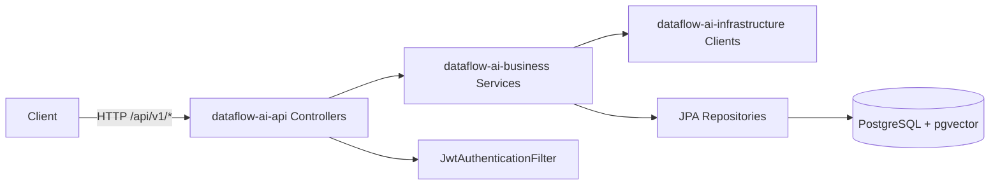

# DataFlow AI — 架构与功能文档

> 版本基于代码库当前实现（Spring Boot 3.2.3）。  
> 所有业务 API 统一前缀：`http://{host}:8080/api`（`server.servlet.context-path=/api`）。

---

## 目录

1. [项目概述](#1-项目概述)
2. [技术栈](#2-技术栈)
3. [模块架构](#3-模块架构)
4. [分层与依赖](#4-分层与依赖)
5. [核心功能](#5-核心功能)
6. [数据流执行引擎](#6-数据流执行引擎)
7. [安全与认证](#7-安全与认证)
8. [数据库设计](#8-数据库设计)
9. [配置说明](#9-配置说明)
10. [统一响应格式](#10-统一响应格式)
11. [REST API 详细说明](#11-rest-api-详细说明)
12. [Actuator 与文档端点](#12-actuator-与文档端点)
13. [附录：枚举与值对象](#13-附录枚举与值对象)

---

## 1. 项目概述

**DataFlow AI** 是一个基于 AI 的数据转换平台：用户通过自然语言描述转换意图，系统结合大语言模型（LLM）与向量检索生成/推荐数据处理节点，并支持将 Source → Transform → Sink 组装为 **Pipeline** 进行执行。

主要能力：

| 能力 | 说明 |
|------|------|
| AI 辅助转换 | 自然语言生成 `Transform` 节点，并持久化到 `ai_helpers` |
| 相似指令检索 | 基于 pgvector 的余弦相似度搜索历史指令 |
| 用户反馈闭环 | accept / modify / reject 反馈用于优化历史记录 |
| 数据源管理 | 多类型数据源，连接配置加密存储 |
| Pipeline 编排 | JSONB 存储 source/transforms/sink/schedule |
| 异步执行 | Pipeline 触发后异步执行，支持取消与统计 |
| 权限与脱敏 | 字段/行级权限模型（引擎侧 `PermissionEngine`） |

---

## 2. 技术栈

| 类别 | 技术 | 版本/说明 |
|------|------|-----------|
| 语言 | Java | 17 |
| 框架 | Spring Boot | 3.2.3 |
| 云组件 | Spring Cloud | 2023.0.0 |
| 数据库 | PostgreSQL + pgvector | JDBC 42.7.2，向量 0.1.4 |
| 持久化 | Spring Data JPA | JSONB 列 + 自定义 AttributeConverter |
| 安全 | Spring Security + JWT | jjwt 0.11.5 |
| API 文档 | Knife4j / OpenAPI 3 | 4.5.0 |
| 工具 | Lombok、MapStruct、Hutool | — |

---

## 3. 模块架构

```
dataflow-ai/                          # 父 POM（多模块）
├── dataflow-ai-common/               # 公共工具、常量、异常占位
├── dataflow-ai-domain/               # 实体、DTO/VO、枚举、JPA 转换器
├── dataflow-ai-infrastructure/       # JWT、加密、LLM/Embedding 客户端
├── dataflow-ai-business/             # 业务服务、仓储实现、执行引擎
├── dataflow-ai-api/                  # REST Controller
├── dataflow-ai-bootstrap/            # 启动类 DataFlowApplication、SecurityConfig
└── dataflow-ai-starter/              # IDE 兼容入口 Main
```

### 模块职责

| 模块 | 职责 |
|------|------|
| **common** | `SecurityUtils`、通用异常类（`GlobalExceptionHandler` 当前为空实现） |
| **domain** | JPA 实体、`request`/`response`、值对象 `SourceConfig`/`Transform` 等 |
| **infrastructure** | `JwtProvider`、`JwtAuthenticationFilter`、`EncryptionService`、`LLMClient`、`EmbeddingClient` |
| **business** | `*Service` 实现、JPA Repository、Pipeline 编排器与 SPI 式 Source/Transform/Sink |
| **api** | 对外 REST 接口，调用 business 层 |
| **bootstrap** | 应用装配、安全配置、配置文件 |
| **starter** | 本地 IDE 运行包装 |

### 请求处理链路（示意）



---

## 4. 分层与依赖

依赖方向（自上而下）：

```
api → business → { domain, infrastructure }
bootstrap → api
infrastructure → domain
business → domain
```

**设计模式要点：**

- **Service 接口 + Impl**：`business/service/` 与 `business/service/impl/`
- **SPI 扩展**：`SourceReader` / `TransformProcessor` / `SinkWriter` + Factory 按类型分发
- **JSONB 转换器**：`domain/converter/*Converter.java` 映射复杂配置到 PostgreSQL JSONB
- **编排器**：`PipelineOrchestrator` 协调 Source → Transform（DAG 拓扑排序）→ Sink

---

## 5. 核心功能

### 5.1 用户与认证

- 登录颁发 JWT（默认有效期 24 小时，可配置）
- JWT 无状态；`logout` 仅服务端记录日志，客户端需自行清除 Token
- 角色：`ADMIN`、`DEVELOPER`、`ANALYST`、`VIEWER`；`@PreAuthorize("hasRole('ADMIN')")` 保护管理接口

### 5.2 数据源

- 支持类型：`MYSQL`、`POSTGRES`、`API`、`KAFKA`、`CSV`
- `connectionConfig` 以 JSONB 存储，写入前经 `EncryptionService` 加密
- 提供连接测试与数据预览（表名 / 自定义 query / 采样条数）

### 5.3 Pipeline

- 包含 `source`、`transforms`、`sink`、`schedule` 四段配置（均为 JSONB）
- 权限级别：`PRIVATE` / `SHARED` / `PUBLIC`（实体枚举 `PermissionLevel`）
- 支持手动触发执行、查询历史 runs、转换结果预览

### 5.4 AI 辅助

1. **generate-transforms**：调用 LLM（`app.llm.provider`，默认 `qianwen`）→ `TransformResponseParser` 解析 `nodes[]` → 生成 embedding → 写入 `ai_helpers`
2. **search-similar**：对指令 embedding，在 `ai_helpers` 上做向量近邻检索
3. **feedback**：更新 `userFeedback`（1 采纳 / 0 拒绝 / -1 修改后采纳）

> **实现注记**：LLM/Embedding 通过 `AiClientConfiguration` 按配置注入；`metadata.modelUsed` 与 `processingTimeMs` 为实测值。

### 5.5 执行

- `POST /pipelines/{id}/run` 创建 `ExecutionRun`（`PENDING`）并 `@Async` 启动
- 执行阶段：`INIT` → `SOURCE` → `TRANSFORM` → `SINK`
- 支持运行中取消（内存 `ExecutionContext` + 原子标志）
- 统计接口返回 total / success / failed / successRate

---

## 6. 数据流执行引擎

### 6.1 核心组件

| 组件 | 类 | 职责 |
|------|-----|------|
| 编排器 | `PipelineOrchestrator` | 三阶段执行、指标收集、取消检测 |
| DAG | `DagBuilder` / `DagExecutor` | 根据 `dependsOn` 拓扑排序 Transform |
| 源读取 | `SourceReaderFactory` | 按 `DataSourceType` 创建 Reader |
| 转换 | `TransformProcessorFactory` | 按 `TransformType` 创建 Processor |
| 目标写入 | `SinkWriterFactory` | 按类型创建 Writer |
| 指标 | `ExecutionMetricsCollector` | 各阶段耗时与记录数 |

### 6.2 Source / Sink 实现矩阵

| 类型 | SourceReader | SinkWriter |
|------|--------------|------------|
| MYSQL / POSTGRES | `DatabaseSourceReader` | `DatabaseSinkWriter` |
| API | `ApiSourceReader` | `ApiSinkWriter` |
| KAFKA | `KafkaSourceReader` | `KafkaSinkWriter` |
| CSV | `CsvSourceReader` | `CsvSinkWriter` |

### 6.3 Transform 处理器

| TransformType | 实现类 |
|---------------|--------|
| FIELD_MAPPER | `FieldMapperProcessor` |
| FILTER | `FilterProcessor` |
| FLATTEN | `FlattenProcessor` |
| LOOKUP | `LookupProcessor` |
| SCRIPT | `ScriptProcessor` |
| AI_ASSISTED | `AiAssistedProcessor` |
| AGGREGATE | `AggregateProcessor` |
| JOIN | `JoinProcessor` |
| SORT | `SortProcessor` |
| GROUP | `GroupProcessor` |

默认批大小：读取/转换 1000 条；Sink 可使用 `SinkConfig.batchSize` 覆盖。

### 6.4 执行状态机

```
PENDING → RUNNING → SUCCESS | FAILED | CANCELLED
```

---

## 7. 安全与认证

### 7.1 放行路径（无需 JWT）

| 路径模式 | 说明 |
|----------|------|
| `/api/v1/auth/**` | 登录、登出 |
| `/api/swagger-ui/**`、`/api/v3/api-docs/**`、`/api/doc.html` 等 | API 文档 |
| `/api/actuator/health` | 健康检查 |

其余路径需认证；未认证 **401**，无权限 **403**。

### 7.2 请求头

```http
Authorization: Bearer <JWT>
Content-Type: application/json
```

JWT Claims 包含：`userId`、`username`、`role`（过滤器中为 `ROLE_{role}`）。

### 7.3 接口级权限

| 接口组 | 额外要求 |
|--------|----------|
| `GET/POST/PUT/DELETE /v1/users`（除 `GET /{id}`） | `ROLE_ADMIN` |
| 其余已认证接口 | 有效 JWT |

---

## 8. 数据库设计

Schema 脚本：`doc/db/init.sql`（需先 `CREATE EXTENSION vector`）。

| 表名 | 用途 |
|------|------|
| `users` | 用户账户 |
| `data_sources` | 数据源及加密连接配置 |
| `pipelines` | Pipeline 定义（JSONB 配置） |
| `execution_runs` | 执行记录、日志、指标 |
| `ai_helpers` | AI 指令、生成节点、embedding（HNSW 索引） |
| `instruction_patterns` | 指令模式模板（向量索引） |
| `audit_logs` | 审计日志 |
| `data_column_permissions` | 列级权限/脱敏 |
| `data_row_permissions` | 行级过滤条件 |

---

## 9. 配置说明

主配置：`dataflow-ai-bootstrap/src/main/resources/application.yml`

| 配置项 | 环境变量 | 说明 |
|--------|----------|------|
| `app.jwt.secret` | `JWT_SECRET` | ≥256 位 |
| `app.jwt.expiration` | `JWT_EXPIRATION` | 默认 86400000 ms |
| `app.encryption.key` | `ENCRYPTION_KEY` | 32 字节，数据源配置加密 |
| `app.llm.provider` | `LLM_PROVIDER` | `qianwen`（默认）/ `openai` / `zhipu` |
| `app.llm.qianwen.api-key` | `QIANWEN_API_KEY` / `DASHSCOPE_API_KEY` | 通义千问 DashScope |
| `app.embedding.provider` | `EMBEDDING_PROVIDER` | 默认 `qianwen`；维度见 `app.embedding.*.dimensions` |
| `spring.profiles.active` | — | 默认 `dev` |

开发库配置见 `application-dev.yml`（数据库名通常为 `dataflow_ai`）。

---

## 10. 统一响应格式

所有 Controller 返回 `ApiResponse<T>`：

```json
{
  "code": 200,
  "msg": "Success",
  "data": { }
}
```

| code | 含义 |
|------|------|
| 200 | 成功（`ResponseCode.SUCCESS`） |
| 400 | 参数无效（枚举已定义，全局处理器未统一映射） |
| 401 | 未认证 |
| 500 | 失败（`ResponseCode.FAILURE`） |

业务异常目前多抛出 `RuntimeException`，由 Spring 默认机制返回 500，**未**统一包装为 `ApiResponse`。

---

## 11. REST API 详细说明

> **完整 URL** = `http://{host}:8080/api` + 下表「路径」  
> 除「认证」分组外，均需在 Header 携带 `Authorization: Bearer <token>`。

---

### 11.1 认证（AuthController）

基础路径：`/v1/auth`

#### POST `/v1/auth/login`

| 项 | 内容 |
|----|------|
| **说明** | 用户登录，返回 JWT |
| **认证** | 不需要 |
| **Content-Type** | `application/json` |

**请求体 `LoginRequest`**

| 字段 | 类型 | 必填 | 说明 |
|------|------|------|------|
| username | string | 是 | 用户名 |
| password | string | 是 | 明文密码 |

**响应 `ApiResponse<LoginResponse>` — data 字段**

| 字段 | 类型 | 说明 |
|------|------|------|
| token | string | JWT |
| userId | string | 用户 ID |
| username | string | 用户名 |
| role | string | 角色名（如 `ADMIN`） |
| department | string | 部门，可空 |

**示例**

```http
POST /api/v1/auth/login
Content-Type: application/json

{"username":"admin","password":"******"}
```

```json
{
  "code": 200,
  "msg": "Success",
  "data": {
    "token": "eyJhbGciOiJIUzI1NiIs...",
    "userId": "u-001",
    "username": "admin",
    "role": "ADMIN",
    "department": "IT"
  }
}
```

---

#### POST `/v1/auth/logout`

| 项 | 内容 |
|----|------|
| **说明** | 登出（服务端无状态，不吊销 Token） |
| **认证** | 不需要（建议仍带 Token 以便审计扩展） |
| **请求体** | 无 |
| **响应** | `ApiResponse<Void>`，`data` 为 null |

---

### 11.2 用户（UserController）

基础路径：`/v1/users`

#### GET `/v1/users`

| 项 | 内容 |
|----|------|
| **说明** | 查询全部用户列表 |
| **权限** | `ROLE_ADMIN` |
| **Query** | 无 |

**响应 data**：`User[]`

| 字段 | 类型 | 说明 |
|------|------|------|
| id | string | 用户 ID |
| username | string | 用户名 |
| email | string | 邮箱 |
| passwordHash | string | 密码哈希（**响应中暴露，生产需注意**） |
| role | UserRole | ADMIN / DEVELOPER / ANALYST / VIEWER |
| department | string | 部门 |
| status | string | 状态 |
| createdAt | datetime | 创建时间 |
| lastLoginAt | datetime | 最后登录 |

---

#### GET `/v1/users/{id}`

| 项 | 内容 |
|----|------|
| **说明** | 按 ID 查询用户 |
| **权限** | 已登录用户 |
| **路径参数** | `id` — 用户 ID |

**响应 data**：单个 `User`（结构同上）  
**错误**：用户不存在时 `RuntimeException` → HTTP 500

---

#### POST `/v1/users`

| 项 | 内容 |
|----|------|
| **说明** | 创建用户 |
| **权限** | `ROLE_ADMIN` |

**请求体 `CreateUserRequest`**

| 字段 | 类型 | 必填 | 校验 | 说明 |
|------|------|------|------|------|
| username | string | 是 | @NotBlank | 用户名 |
| email | string | 是 | @Email | 邮箱 |
| password | string | 是 | @Size(min=6) | 密码 |
| role | UserRole | 是 | @NotNull | 角色枚举 |
| department | string | 否 | — | 部门 |

**响应 data**：创建后的 `User`

---

#### PUT `/v1/users/{id}`

| 项 | 内容 |
|----|------|
| **说明** | 更新用户（请求体为完整 `User` 实体） |
| **权限** | `ROLE_ADMIN` |
| **路径参数** | `id` — 将覆盖 body 中的 id |

**请求体**：`User` JSON（字段同 GET 响应）

**响应 data**：更新后的 `User`

---

#### DELETE `/v1/users/{id}`

| 项 | 内容 |
|----|------|
| **说明** | 删除用户 |
| **权限** | `ROLE_ADMIN` |
| **响应** | `ApiResponse<Void>` |

---

### 11.3 数据源（DataSourceController）

基础路径：`/v1/data-sources`  
> 注意：路径为 **data-sources**（带连字符），非 README 中的 `datasources`。

#### POST `/v1/data-sources`

| 项 | 内容 |
|----|------|
| **说明** | 创建数据源（归属当前登录用户） |

**请求体 `CreateDataSourceRequest`**

| 字段 | 类型 | 必填 | 说明 |
|------|------|------|------|
| name | string | 建议填 | 数据源名称 |
| type | DataSourceType | 建议填 | MYSQL / POSTGRES / API / KAFKA / CSV |
| connectionConfig | object | 建议填 | 连接参数 Map，写入前加密 |

**connectionConfig 示例（MySQL，逻辑结构，实际键名以实现为准）**

```json
{
  "host": "localhost",
  "port": 3306,
  "database": "demo",
  "username": "root",
  "password": "secret"
}
```

**响应 data**：`DataSource`

| 字段 | 类型 | 说明 |
|------|------|------|
| id | string | 数据源 ID |
| name | string | 名称 |
| type | DataSourceType | 类型 |
| connectionConfig | object | 加密后的配置（可能不可读） |
| createdBy | string | 创建者 userId |
| createdAt / updatedAt | datetime | 时间戳 |

---

#### GET `/v1/data-sources`

| 项 | 内容 |
|----|------|
| **说明** | 列出**当前用户**创建的数据源 |
| **响应 data** | `DataSource[]` |

---

#### GET `/v1/data-sources/{id}`

| 项 | 内容 |
|----|------|
| **说明** | 数据源详情 |
| **路径参数** | `id` |

---

#### PUT `/v1/data-sources/{id}`

**请求体 `UpdateDataSourceRequest`**（字段均可选，只更新非 null 字段）

| 字段 | 类型 | 说明 |
|------|------|------|
| name | string | 名称 |
| type | DataSourceType | 类型 |
| connectionConfig | object | 新连接配置（会重新加密） |

---

#### DELETE `/v1/data-sources/{id}`

删除指定数据源。

---

#### POST `/v1/data-sources/{id}/test`

| 项 | 内容 |
|----|------|
| **说明** | 测试数据源连通性 |
| **响应 data** | `boolean` — `true` 表示成功 |

---

#### POST `/v1/data-sources/{id}/preview`

| 项 | 内容 |
|----|------|
| **说明** | 预览源数据样本 |

**Query 参数**

| 参数 | 类型 | 必填 | 默认 | 说明 |
|------|------|------|------|------|
| tableName | string | 否 | — | 表名（库表类源） |
| query | string | 否 | — | 自定义 SQL/查询 |
| sampleSize | int | 否 | 10 | 采样条数 |

**响应 data**：`Map<String, Object>`（结构由 `DataSourceService.previewSourceData` 决定，通常含列信息与样本行）

---

### 11.4 Pipeline（PipelineController）

基础路径：`/v1/pipelines`

#### POST `/v1/pipelines`

**请求体 `CreatePipelineRequest`**

| 字段 | 类型 | 说明 |
|------|------|------|
| name | string | Pipeline 名称 |
| description | string | 描述 |
| source | SourceConfig | 源配置（见附录） |
| transforms | Transform[] | 转换节点列表 |
| sink | SinkConfig | 目标配置 |
| schedule | ScheduleConfig | 调度配置 |
| permissionLevel | string | 权限级别字符串 |
| allowedRoles | string[] | 允许角色（创建请求支持，实体字段部分注释） |
| allowedUsers | string[] | 允许用户 |
| allowedDepartments | string[] | 允许部门 |

**响应 data**：`Pipeline` 实体

| 字段 | 类型 | 说明 |
|------|------|------|
| id | string | Pipeline ID |
| name / description | string | 名称与描述 |
| source / transforms / sink / schedule | object | JSONB 配置 |
| ownerId | string | 所有者 userId |
| permissionLevel | enum | PRIVATE / SHARED / PUBLIC |
| status | string | 如 active |
| createdAt / updatedAt | datetime | 时间 |

---

#### GET `/v1/pipelines`

| Query | 类型 | 默认 | 说明 |
|-------|------|------|------|
| name | string | — | 代码中**未使用**，仅返回当前用户全部 Pipeline |
| page | int | 0 | 未实现分页 |
| size | int | 20 | 未实现分页 |

**响应 data**：`Pipeline[]`（当前用户的 Pipeline）

---

#### GET `/v1/pipelines/{id}`

Pipeline 详情。

---

#### PUT `/v1/pipelines/{id}`

| 项 | 内容 |
|----|------|
| **请求体** | 完整 `Pipeline` JSON |
| **说明** | 按 ID 更新 Pipeline 配置 |

---

#### DELETE `/v1/pipelines/{id}`

删除 Pipeline。

---

#### POST `/v1/pipelines/{id}/run`

| 项 | 内容 |
|----|------|
| **说明** | 触发 Pipeline 执行（异步） |
| **响应 data** | `ExecutionRun`（初始状态多为 PENDING，随后 RUNNING） |

**ExecutionRun 字段**

| 字段 | 类型 | 说明 |
|------|------|------|
| id | string | 执行 ID |
| pipelineId | string | 所属 Pipeline |
| status | ExecutionStatus | PENDING/RUNNING/SUCCESS/FAILED/CANCELLED |
| startTime / endTime | datetime | 起止时间 |
| errorMessage | string | 失败信息 |
| executionLog | object | JSON 日志 |
| metrics | object | 指标 JSON |
| triggeredBy | string | 触发用户 ID |
| createdAt | datetime | 创建时间 |

---

#### GET `/v1/pipelines/{id}/runs`

返回该 Pipeline 下所有 `ExecutionRun` 列表。

---

#### GET `/v1/pipelines/{id}/preview`

| 项 | 内容 |
|----|------|
| **说明** | 预览转换结果（内部 `sampleSize=10`） |
| **响应 data** | `Map<String, Object>` |

---

### 11.5 执行（ExecutionController）

基础路径：`/v1/execution`  
> 注意：单数 **execution**，非 `executions`。

#### GET `/v1/execution/runs/{runId}`

查询单次执行详情，响应 `ExecutionRun`。

---

#### POST `/v1/execution/runs/{runId}/cancel`

| 项 | 内容 |
|----|------|
| **说明** | 取消正在运行的任务 |
| **响应** | `ApiResponse<Void>` |
| **行为** | 设置内存取消标志；若任务已结束可能仅更新 DB 状态 |

---

#### GET `/v1/execution/pipelines/{pipelineId}/stats`

**响应 data 结构**

| 字段 | 类型 | 说明 |
|------|------|------|
| total | number | 总执行次数 |
| success | number | 成功次数 |
| failed | number | 失败次数 |
| successRate | number | success/total，total=0 时为 0.0 |

---

### 11.6 AI 辅助（AIController）

基础路径：`/v1/ai`

#### POST `/v1/ai/generate-transforms`

**请求体 `GenerateTransformsRequest`**

| 字段 | 类型 | 说明 |
|------|------|------|
| instruction | string | 自然语言指令 |
| context | Context | 可选上下文 |
| context.sourceSchema | SourceSchema | 源字段 schema |
| context.targetSchema | TargetSchema | 目标 schema |
| context.sampleData | object[] | 样本数据行 |
| options.maxNodes | int | 默认 10 |
| options.strict | boolean | 默认 true |

**FieldInfo**：`name`, `type`, `sample`

**响应 `GenerateTransformsResponse`（data）**

| 字段 | 类型 | 说明 |
|------|------|------|
| nodes | Transform[] | 生成的转换节点 |
| source.type | string | `historical_pattern` / `llm_generated` |
| source.confidence | number | 置信度 |
| source.matchedInstruction | string | 匹配的历史指令 |
| suggestions[] | type, message | 建议列表 |
| visualization.summary / dataFlow | string | 可视化摘要 |
| metadata.processingTimeMs | long | 耗时 |
| metadata.modelUsed | string | 模型名称 |

---

#### POST `/v1/ai/search-similar`

**请求体 `SearchSimilarRequest`**

| 字段 | 类型 | 默认 | 说明 |
|------|------|------|------|
| instruction | string | — | 查询文本 |
| limit | int | 5 | 返回条数上限 |
| minSimilarity | double | 0.8 | 最小相似度阈值 |

**响应 `SearchSimilarResponse`**

| 字段 | 类型 | 说明 |
|------|------|------|
| results[].instruction | string | 历史指令 |
| results[].similarity | double | 余弦相似度 |
| results[].useCount | int | 使用次数（部分为占位 0） |
| results[].acceptanceRate | double | 采纳率（部分为占位） |
| results[].generatedNodes | Transform[] | 当时生成的节点 |

---

#### POST `/v1/ai/feedback`

**请求体 `FeedbackRequest`**

| 字段 | 类型 | 必填 | 说明 |
|------|------|------|------|
| aiHelperId | string | 是 | `ai_helpers.id` |
| action | string | 是 | `accept` / `modify` / `reject` |
| modifiedNodes | Transform[] | 否 | modify 时提交修改后的节点 |
| pipelineId | string | 否 | 关联 Pipeline |

**响应**：`ApiResponse<Void>`

**反馈映射**

| action | userFeedback 存储值 |
|--------|---------------------|
| accept | 1 |
| reject | 0 |
| modify | -1 |

---

## 12. Actuator 与文档端点

### 12.1 Spring Boot Actuator

基础路径：`/api/actuator`（受 context-path 影响）

| 端点 | 方法 | 认证 | 说明 |
|------|------|------|------|
| `/api/actuator/health` | GET | 公开 | 健康检查 |
| `/api/actuator/info` | GET | 需认证* | 应用信息 |
| `/api/actuator/metrics` | GET | 需认证* | 指标 |
| `/api/actuator/prometheus` | GET | 需认证* | Prometheus 格式指标 |

\* `management.endpoint.health.show-details=when_authorized`；非 health 端点在 Security 中走 `anyRequest().authenticated()`。

### 12.2 API 文档（Knife4j / Swagger）

| 地址 | 说明 |
|------|------|
| http://localhost:8080/api/doc.html | Knife4j UI（中文） |
| http://localhost:8080/api/swagger-ui.html | Swagger UI |
| http://localhost:8080/api/v3/api-docs | OpenAPI JSON |

---

## 13. 附录：枚举与值对象

### 13.1 SourceConfig

```json
{
  "dataSourceId": "ds-uuid",
  "type": "MYSQL",
  "tableName": "orders",
  "query": "SELECT * FROM orders WHERE dt = '2026-01-01'",
  "params": {}
}
```

### 13.2 SinkConfig

```json
{
  "dataSourceId": "ds-uuid",
  "tableName": "orders_clean",
  "writeMode": "APPEND",
  "batchSize": 1000,
  "params": {}
}
```

`writeMode`：`APPEND` | `OVERWRITE` | `IGNORE_DUPLICATES` | `UPDATE_EXISTING`

### 13.3 Transform

```json
{
  "nodeId": "t1",
  "type": "FIELD_MAPPER",
  "name": "字段映射",
  "description": "",
  "config": { "mappings": [] },
  "dependsOn": [],
  "generatedBy": "ai-helper-id"
}
```

### 13.4 ScheduleConfig

```json
{
  "scheduleType": "MANUAL",
  "cronExpression": "0 0 * * * ?",
  "interval": 3600,
  "timezone": "Asia/Shanghai",
  "enabled": false,
  "retryCount": 3,
  "retryInterval": 60
}
```

`scheduleType`：`MANUAL` | `FIXED_RATE` | `FIXED_DELAY` | `CRON`

### 13.5 接口总览表

| # | 方法 | 路径 | 认证 | 权限 | 说明 |
|---|------|------|------|------|------|
| 1 | POST | /v1/auth/login | 否 | — | 登录 |
| 2 | POST | /v1/auth/logout | 否 | — | 登出 |
| 3 | GET | /v1/users | 是 | ADMIN | 用户列表 |
| 4 | GET | /v1/users/{id} | 是 | — | 用户详情 |
| 5 | POST | /v1/users | 是 | ADMIN | 创建用户 |
| 6 | PUT | /v1/users/{id} | 是 | ADMIN | 更新用户 |
| 7 | DELETE | /v1/users/{id} | 是 | ADMIN | 删除用户 |
| 8 | POST | /v1/data-sources | 是 | — | 创建数据源 |
| 9 | GET | /v1/data-sources | 是 | — | 我的数据源列表 |
| 10 | GET | /v1/data-sources/{id} | 是 | — | 数据源详情 |
| 11 | PUT | /v1/data-sources/{id} | 是 | — | 更新数据源 |
| 12 | DELETE | /v1/data-sources/{id} | 是 | — | 删除数据源 |
| 13 | POST | /v1/data-sources/{id}/test | 是 | — | 测试连接 |
| 14 | POST | /v1/data-sources/{id}/preview | 是 | — | 预览数据 |
| 15 | POST | /v1/pipelines | 是 | — | 创建 Pipeline |
| 16 | GET | /v1/pipelines | 是 | — | Pipeline 列表 |
| 17 | GET | /v1/pipelines/{id} | 是 | — | Pipeline 详情 |
| 18 | PUT | /v1/pipelines/{id} | 是 | — | 更新 Pipeline |
| 19 | DELETE | /v1/pipelines/{id} | 是 | — | 删除 Pipeline |
| 20 | POST | /v1/pipelines/{id}/run | 是 | — | 执行 Pipeline |
| 21 | GET | /v1/pipelines/{id}/runs | 是 | — | 执行历史 |
| 22 | GET | /v1/pipelines/{id}/preview | 是 | — | 预览转换 |
| 23 | GET | /v1/execution/runs/{runId} | 是 | — | 执行详情 |
| 24 | POST | /v1/execution/runs/{runId}/cancel | 是 | — | 取消执行 |
| 25 | GET | /v1/execution/pipelines/{pipelineId}/stats | 是 | — | 执行统计 |
| 26 | POST | /v1/ai/generate-transforms | 是 | — | AI 生成节点 |
| 27 | POST | /v1/ai/search-similar | 是 | — | 相似指令搜索 |
| 28 | POST | /v1/ai/feedback | 是 | — | AI 反馈 |

**合计：28 个业务 REST 接口**（不含 Actuator 与文档静态资源）。

---

## 变更与已知差异

| 项 | 说明 |
|----|------|
| README 路径 | README 写 `/datasources`、`/executions`，实际为 `data-sources`、`execution` |
| 分页 | `GET /pipelines` 的 page/size 参数未接入 Repository |
| 全局异常 | `GlobalExceptionHandler` 为空，错误响应格式不统一 |
| AI 解析 | ✅ 已实现 `TransformResponseParser`；历史模式匹配等待 TODO-011 |
| 用户密码 | `GET` 用户接口可能返回 `passwordHash`，生产应使用 DTO 脱敏 |

---

*文档生成自源码分析。在线交互式文档请访问：http://localhost:8080/api/doc.html*
