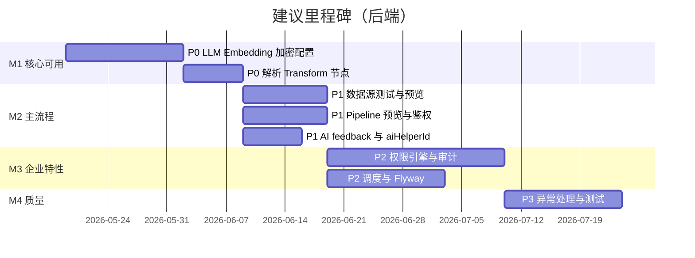

# DataFlow AI — 后端未完成功能 TODO（排除前端/UI）

> 基于 `doc/ARCHITECTURE_AND_API.md` 与当前 Java 源码对照梳理。  
> **范围**：`dataflow-ai-*` 模块及数据库脚本；不含 `web/` 前端。  
> **更新日期**：2026-05-22（P3 完成）

---

## 优先级说明

| 级别 | 含义 | 建议 |
|------|------|------|
| **P0** | 阻塞核心能力；无此功能则产品承诺的 AI/数据能力不可用或存在严重缺陷 | 立即排期 |
| **P1** | 重要功能已暴露 API/架构，但实现为空或占位；影响主流程可用性 | 已完成（2026-05-21） |
| **P2** | 架构已设计（表/接口/类存在），未接入或未闭环；影响安全、运维、协作 | 已完成（2026-05-21） |
| **P3** | 体验、一致性、测试与工程化；不阻塞单机演示 | 已完成（2026-05-22） |

**状态**：`未开始` | `部分实现` | `仅骨架`

---

## P0 — 阻塞核心能力（已完成 2026-05-20）

### TODO-001 OpenAI / 智谱 / 通义千问 LLM 真实 HTTP 调用

| 项 | 内容 |
|----|------|
| **状态** | ✅ 已完成 |
| **位置** | `OpenAiCompatibleLlmClient`、`AiClientConfiguration` |
| **实现** | OpenAI 兼容 Chat Completions；`qianwen`（DashScope 兼容模式）为默认；失败抛 `LlmApiException` |
| **配置** | `app.llm.provider`、`app.llm.{qianwen,openai,zhipu}.*`；环境变量 `QIANWEN_API_KEY` / `DASHSCOPE_API_KEY` |

---

### TODO-002 LLM 响应解析为 `Transform` 节点列表

| 项 | 内容 |
|----|------|
| **状态** | ✅ 已完成 |
| **位置** | `TransformResponseParser`、`AIServiceImpl.generateTransforms()` |
| **实现** | 解析 `nodes[]`（nodeId/type/config/dependsOn）；失败抛 `BusinessException`；`processingTimeMs` 实测 |

---

### TODO-003 Embedding 真实 API 与维度一致

| 项 | 内容 |
|----|------|
| **状态** | ✅ 已完成 |
| **位置** | `EmbeddingGenerator`、`OpenAiCompatibleEmbeddingGenerator`、`EmbeddingClient` |
| **实现** | 独立 Embedding 实现；按 `app.embedding.provider` 切换；失败不再返回零向量 |
| **维度** | 通义默认 1024、OpenAI 1536、智谱 1024（可配置） |

---

### TODO-004 按配置切换 LLM / Embedding 提供商

| 项 | 内容 |
|----|------|
| **状态** | ✅ 已完成 |
| **位置** | `AiClientConfiguration`、`AIServiceImpl` |
| **实现** | `@ConditionalOnProperty` 注册单一 `@Primary` Bean；`metadata.modelUsed` 来自 `llmClient.getModelName()` |

---

### TODO-005 加密配置项与 `EncryptionService` 对齐

| 项 | 内容 |
|----|------|
| **状态** | ✅ 已完成 |
| **位置** | `EncryptionService` |
| **实现** | 读取 `app.encryption.key`；启动校验恰好 32 字节 UTF-8；AES-256；`EncryptionServiceTest` |

---

## P1 — 主流程 API 占位 / 闭环缺失（已完成 2026-05-21）

### TODO-006 数据源连接测试（真实探测）

| 项 | 内容 |
|----|------|
| **状态** | ✅ 已完成 |
| **位置** | `DataSourceServiceImpl.testConnection()`、`SourceReader.testConnection()` |
| **实现** | 解密配置后按类型经 `SourceReaderFactory` 调用 JDBC / HTTP / Kafka / 文件等真实探测 |
| **API** | `POST /v1/data-sources/{id}/test` |
| **单测** | `DataSourceServiceImplTest` |

---

### TODO-007 数据源数据预览

| 项 | 内容 |
|----|------|
| **状态** | ✅ 已完成 |
| **位置** | `DataSourceServiceImpl.previewSourceData()`、`RecordPreviewMapper` |
| **实现** | `SourceReader.preview` 返回 `columns` / `rows` / `rowCount`（≤ sampleSize） |
| **API** | `POST /v1/data-sources/{id}/preview` |
| **单测** | `DataSourceServiceImplTest` |

---

### TODO-008 Pipeline 转换结果预览

| 项 | 内容 |
|----|------|
| **状态** | ✅ 已完成 |
| **位置** | `PipelinePreviewExecutor`、`PipelineServiceImpl.previewTransform()` |
| **实现** | 源采样 → 执行 transforms（限流）→ 返回预览样本，不写 Sink |
| **API** | `GET /v1/pipelines/{id}/preview` |
| **单测** | `PipelineServiceImplTest` |

---

### TODO-009 AI 生成响应返回 `aiHelperId`

| 项 | 内容 |
|----|------|
| **状态** | ✅ 已完成 |
| **位置** | `GenerateTransformsResponse`、`AIServiceImpl` |
| **实现** | 持久化 `AiHelper` 后响应体返回 `aiHelperId`，供 `/v1/ai/feedback` 关联 |

---

### TODO-010 AI 反馈闭环（`instruction_patterns` + 统计）

| 项 | 内容 |
|----|------|
| **状态** | ✅ 已完成 |
| **位置** | `InstructionPattern` / `InstructionPatternRepository`、`AIServiceImpl.submitFeedback()` |
| **实现** | accept/modify upsert 模式与 embedding；reject 降权；`pipelineId` 写入 `ai_helpers` |

---

### TODO-011 生成转换前优先匹配历史模式（`historical_pattern`）

| 项 | 内容 |
|----|------|
| **状态** | ✅ 已完成 |
| **位置** | `AIServiceImpl.generateTransforms()` |
| **实现** | 先查 `instruction_patterns`；命中则 `source.type=historical_pattern` 并返回模板节点；否则走 LLM |
| **配置** | `app.ai.historical-pattern-min-similarity`（默认 0.85） |

---

### TODO-012 相似搜索统计字段真实化

| 项 | 内容 |
|----|------|
| **状态** | ✅ 已完成 |
| **位置** | `AIServiceImpl.searchSimilar()` |
| **实现** | `useCount` / `acceptanceRate` 来自 `instruction_patterns` 或 `ai_helpers` 反馈聚合 |

---

### TODO-013 向量检索阈值语义校正

| 项 | 内容 |
|----|------|
| **状态** | ✅ 已完成 |
| **位置** | `VectorSimilarityUtils`、`AiHelperJpaRepository.searchByEmbedding` |
| **实现** | `minSimilarity` → `maxCosineDistance = 1 - similarity` 再传入 SQL `<=>` |
| **单测** | `VectorSimilarityUtilsTest` |

---

### TODO-014 流水线内 `AI_ASSISTED` 转换节点可用

| 项 | 内容 |
|----|------|
| **状态** | ✅ 已完成 |
| **位置** | `AiAssistedProcessor` |
| **实现** | `LLMClient.complete` + `RowTransformPromptBuilder`；解析 JSON 写入 `outputField` |

---

### TODO-015 资源级授权接入 Controller

| 项 | 内容 |
|----|------|
| **状态** | ✅ 已完成 |
| **位置** | `DataSourceController`、`PipelineController`、`ExecutionController`、`ResourceAuthorizationHelper` |
| **实现** | 读/改/删/执行前校验 `PermissionService`；数据源按 `createdBy`/ADMIN；Pipeline 按 owner/权限 |
| **单测** | `PermissionServiceImplTest`；Controller 测试经 `ControllerTestAuthSupport` Mock 鉴权 |

---

## P2 — 架构已设计、未闭环（已完成 2026-05-21）

### TODO-016 `PermissionEngine` 实现与执行链集成

| 项 | 内容 |
|----|------|
| **状态** | ✅ 已完成 |
| **实现** | `PermissionEngineImpl`、`DefaultMaskProcessor`；读取 `app.permission.enabled`；`DataSourceServiceImpl.preview` 出口脱敏 |
| **表名** | 实体映射 `data_column_permissions`（与 init.sql 一致） |

### TODO-017 行级权限

| 项 | 内容 |
|----|------|
| **状态** | ✅ 已完成 |
| **实现** | `DataRowPermission` + `RowPermissionRepository`；`RowFilterEvaluator`（`field=value`） |

### TODO-018 字段/行权限 REST API

| 项 | 内容 |
|----|------|
| **状态** | ✅ 已完成 |
| **API** | `DataPermissionController`：`column-permissions` / `row-permissions` CRUD |

### TODO-019 审计日志

| 项 | 内容 |
|----|------|
| **状态** | ✅ 已完成 |
| **实现** | `AuditAspect`（登录/数据源创建/Pipeline 创建与执行）；`AuditLogController` 分页查询；记录 ip/userAgent |

### TODO-020 全局异常处理

| 项 | 内容 |
|----|------|
| **状态** | ✅ 已完成 |
| **实现** | `api/exception/GlobalExceptionHandler`；`ResponseCode` 403/404/409；`ResourceAuthorizationHelper` 使用 `BusinessException` |

### TODO-021 Pipeline 定时调度

| 项 | 内容 |
|----|------|
| **状态** | ✅ 已完成（单机轮询） |
| **实现** | `PipelineScheduleRunner`（CRON / FIXED_RATE / FIXED_DELAY）；`@EnableScheduling` |
| **说明** | 多实例分布式锁待 P3 或运维层补充 |

### TODO-022 Pipeline 权限模型

| 项 | 内容 |
|----|------|
| **状态** | ✅ 已完成 |
| **实现** | 恢复 `allowedRoles/Users/Departments` JSONB；创建时尊重 `permissionLevel`；`checkSharedAccess`；列表合并 owner/PUBLIC/SHARED |

### TODO-023 JWT Refresh Token

| 项 | 内容 |
|----|------|
| **状态** | ✅ 已完成 |
| **API** | 登录返回 `token` + `refreshToken`；`POST /v1/auth/refresh` |

### TODO-024 用户改密 API

| 项 | 内容 |
|----|------|
| **状态** | ✅ 已完成 |
| **API** | `PUT /v1/users/me/password`；BCrypt 校验旧密码 |

### TODO-025 用户响应 DTO 脱敏

| 项 | 内容 |
|----|------|
| **状态** | ✅ 已完成 |
| **实现** | `UserVO` + `UserMapper`；Controller 不再返回 `passwordHash` |

### TODO-026 Pipeline 列表分页

| 项 | 内容 |
|----|------|
| **状态** | ✅ 已完成 |
| **API** | `GET /v1/pipelines?name=&page=&size=` → `PageResponse` |

### TODO-027 全局执行记录列表

| 项 | 内容 |
|----|------|
| **状态** | ✅ 已完成 |
| **API** | `GET /v1/execution/runs?status=&page=&size=`；修复 `findRunningExecutions` |

### TODO-028 `executionLog` 持久化

| 项 | 内容 |
|----|------|
| **状态** | ✅ 已完成 |
| **API** | `GET /v1/execution/runs/{id}/logs`；编排器/执行服务分阶段写入 JSONB `entries` |

### TODO-029 Flyway

| 项 | 内容 |
|----|------|
| **状态** | ✅ 已完成（增量迁移） |
| **实现** | `flyway-core`；`V2__p2_pipeline_and_execution.sql`；`baseline-on-migrate`；存量库仍可用 `doc/db/init.sql` |

### TODO-030 多实例执行取消

| 项 | 内容 |
|----|------|
| **状态** | ✅ 已完成（DB 标志） |
| **实现** | `execution_runs.cancel_requested`；取消时落库；Worker 轮询 `isCancelRequested` |
| **说明** | 未引入 Redis；重启后 RUNNING 任务需运维处理 |

### TODO-031 JOIN 与 DAG

| 项 | 内容 |
|----|------|
| **状态** | ✅ 已完成 |
| **实现** | `TransformDagSupport`：节点输出 `transform_output_{nodeId}`；JOIN 前注入 `join_right_records`（`dependsOn` / `rightNodeId`） |

---

## P3 — 工程化与一致性

### TODO-032 智谱客户端配置键修正

| 项 | 内容 |
|----|------|
| **状态** | ✅ 已完成 |
| **位置** | `AiClientConfiguration`（`app.llm.zhipu.*`）；无独立 `ZhiPuClient` |
| **实现** | 智谱经 OpenAI 兼容客户端装配；`ZhipuClientConfigurationTest` 校验 `@ConditionalOnProperty` |
| **验收** | 与 `application.yml` 一致；集成测试可选用 mock |

---

### TODO-033 空拦截器清理或实现

| 项 | 内容 |
|----|------|
| **状态** | ✅ 已完成 |
| **位置** | `UserContextInterceptor`、`WebMvcConfig`；已删除空 `AuthInterceptor` |
| **实现** | MDC 写入 `userId`、`requestId`（来自 `SecurityUtils` / `X-Request-Id`） |
| **验收** | 删除死代码，或补充 MDC 用户上下文 / 审计 id |

---

### TODO-034 `infrastructure/client/datasource` 模块

| 项 | 内容 |
|----|------|
| **状态** | ✅ 已完成 |
| **位置** | `infrastructure/client/datasource/`：`SensitiveConnectionKeys`、`JdbcConnectionTester`、`DataSourceClientFacade` |
| **实现** | `DatabaseSourceReader.testConnection()` 委托 `JdbcConnectionTester`；敏感 key 与加密模块共用 |
| **验收** | 将连接测试/预览/Reader 共用逻辑下沉，避免与 `DataSourceServiceImpl` TODO 重复实现 |

---

### TODO-035 重试策略接入执行引擎

| 项 | 内容 |
|----|------|
| **状态** | ✅ 已完成 |
| **位置** | `EngineProperties`、`ExecutionRetryHelper`、`PipelineOrchestrator` |
| **实现** | Source/Sink 读写经 `ExponentialBackoffRetry`；`app.engine.*` 与 `ScheduleConfig.retryCount` 取较大重试次数 |
| **验收** | Source/Sink/外部 API 可配置重试；与 `ScheduleConfig.retryCount` 联动 |

---

### TODO-036 DAG 并行执行路径

| 项 | 内容 |
|----|------|
| **状态** | ✅ 已完成 |
| **位置** | `PipelineOrchestrator`、`app.engine.parallel-dag-enabled` |
| **实现** | 默认拓扑序串行；`parallel-dag-enabled=true` 时按 DAG 层级分组执行（同层仍串行写回，保证正确性） |
| **验收** | 无依赖节点并行；或明确文档仅串行 |

---

### TODO-037 登录参数校验

| 项 | 内容 |
|----|------|
| **状态** | ✅ 已完成 |
| **位置** | `LoginRequest`、`AuthControllerTest` |
| **实现** | `username`/`password` 增加 `@NotBlank`；空参返回 400 + `ApiResponse` |
| **验收** | 补校验注解；错误返回 400 + 统一 `ApiResponse` |

---

### TODO-038 后端自动化测试覆盖

| 项 | 内容 |
|----|------|
| **状态** | ✅ 已完成（单元/切片；Testcontainers 为后续增强） |
| **位置** | `dataflow-ai-api` / `business` / `infrastructure` 测试包 |
| **实现** | 新增 `ExponentialBackoffRetryTest`、`JdbcConnectionTesterTest`、`GlobalExceptionHandlerTest`、`ZhipuClientConfigurationTest`；Controller/Service 覆盖延续 P1/P2 |
| **验收** | 核心 API 集成测试（Testcontainers PG + pgvector）；引擎单测；AI/LLM 用 WireMock |

---

### TODO-039 执行指标与 Prometheus 业务指标

| 项 | 内容 |
|----|------|
| **状态** | ✅ 已完成 |
| **位置** | `ExecutionMetricsCollector`、`micrometer-core`（business 模块） |
| **实现** | 可选 `MeterRegistry` 注册 `dataflow.pipeline.records.processed`、`dataflow.pipeline.execution.duration`；保留 JSON metrics |
| **验收** | 将 recordsProcessed、duration 等注册为 Micrometer 指标（可选） |

---

### TODO-040 数据源非字符串字段加密策略

| 项 | 内容 |
|----|------|
| **状态** | ✅ 已完成 |
| **位置** | `EncryptionService`、`SensitiveConnectionKeys` |
| **实现** | 敏感 key（`url`、`password`、`api_key` 等）对 String/Number 加密；Map/Iterable 可整包 JSON 加密 |
| **验收** | 约定敏感 key 列表或整包 JSON 加密 |

---

## 汇总看板

| 优先级 | 数量 | 代表项 |
|--------|------|--------|
| P0 | 0（已完成 5 项） | — |
| P1 | 0（已完成 10 项） | — |
| P2 | 0（已完成 16 项） | — |
| P3 | 0（已完成 9 项） | — |
| **合计** | **0** 待办 | P0～P3 共 40 项已完成 |

---

## 已完成（P0，2026-05-20）

- TODO-001～005：见上文 P0 各节（含通义千问 `qianwen` 默认提供商）

## 已完成（P1，2026-05-21）

- TODO-006～015：见上文 P1 各节（数据源测试/预览、Pipeline 预览、AI 闭环与向量阈值、`AI_ASSISTED`、Controller 资源鉴权）

## 已完成（P2，2026-05-21）

- TODO-016～031：见上文 P2 各节（权限引擎、审计、调度、JWT/分页、Flyway V2、执行日志与取消、JOIN DAG）

## 已完成（P3，2026-05-22）

- TODO-032～040：见上文 P3 各节（智谱配置校验、MDC 拦截器、datasource 客户端包、引擎重试、DAG 层级执行、登录校验、测试与 Micrometer、加密增强）

---

## 建议实施顺序（后端-only 里程碑）

1. **M1**：完成 TODO-001～005、002 → 平台可演示真实 AI 生成与向量搜索。  
2. **M2**：TODO-006～015 → API 文档描述能力与实现一致。  
3. **M3**：TODO-016～031 → 安全、调度、运维可上线。  
4. **M4**：TODO-032～040 → 可维护性与发布信心。

---

## 已相对完成（供对照，不列入 TODO）

以下后端能力**已有实质代码**，仅需加固或边界场景：

- JWT 登录、过滤器、角色注解（ADMIN 用户管理）
- 数据源 CRUD + 连接配置加密存储（在 TODO-005 修复前提下）
- Pipeline CRUD、异步执行、`PipelineOrchestrator` 三阶段
- 多数 Transform 处理器（FIELD_MAPPER、FILTER、AGGREGATE 等）
- Database / API / Kafka / CSV 的 SourceReader、部分 SinkWriter
- `ai_helpers` pgvector 检索 SQL（阈值经 `VectorSimilarityUtils` 校正）
- Knife4j / Actuator health
- `ExecutionService` 取消（单机）、执行统计

---

*与 [ARCHITECTURE_AND_API.md](./ARCHITECTURE_AND_API.md) 配套维护；完成项请更新本文状态或移至「已完成」章节。*
