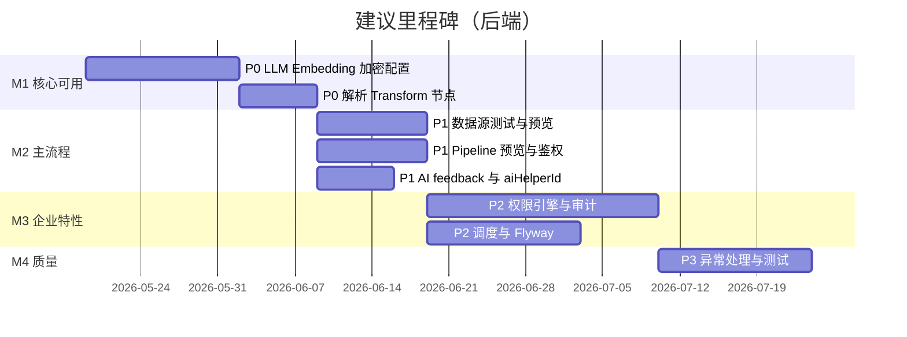

# DataFlow AI — 后端未完成功能 TODO（排除前端/UI）

> 基于 `doc/ARCHITECTURE_AND_API.md` 与当前 Java 源码对照梳理。  
> **范围**：`dataflow-ai-*` 模块及数据库脚本；不含 `web/` 前端。  
> **更新日期**：2026-05-20

---

## 优先级说明

| 级别 | 含义 | 建议 |
|------|------|------|
| **P0** | 阻塞核心能力；无此功能则产品承诺的 AI/数据能力不可用或存在严重缺陷 | 立即排期 |
| **P1** | 重要功能已暴露 API/架构，但实现为空或占位；影响主流程可用性 | 当前迭代 |
| **P2** | 架构已设计（表/接口/类存在），未接入或未闭环；影响安全、运维、协作 | 下一迭代 |
| **P3** | 体验、一致性、测试与工程化；不阻塞单机演示 | 按需 |

**状态**：`未开始` | `部分实现` | `仅骨架`

---

## P0 — 阻塞核心能力（已完成 2026-05-20）

### TODO-001 OpenAI / 智谱 / 通义千问 LLM 真实 HTTP 调用

| 项 | 内容 |
|----|------|
| **状态** | ✅ 已完成 |
| **位置** | `OpenAiCompatibleLlmClient`、`AiClientConfiguration` |
| **实现** | OpenAI 兼容 Chat Completions；`qianwen`（DashScope 兼容模式）为默认；失败抛 `LlmApiException` |
| **配置** | `app.llm.provider`、`app.llm.{qianwen,openai,zhipu}.*`；环境变量 `QIANWEN_API_KEY` / `DASHSCOPE_API_KEY` |

---

### TODO-002 LLM 响应解析为 `Transform` 节点列表

| 项 | 内容 |
|----|------|
| **状态** | ✅ 已完成 |
| **位置** | `TransformResponseParser`、`AIServiceImpl.generateTransforms()` |
| **实现** | 解析 `nodes[]`（nodeId/type/config/dependsOn）；失败抛 `BusinessException`；`processingTimeMs` 实测 |

---

### TODO-003 Embedding 真实 API 与维度一致

| 项 | 内容 |
|----|------|
| **状态** | ✅ 已完成 |
| **位置** | `EmbeddingGenerator`、`OpenAiCompatibleEmbeddingGenerator`、`EmbeddingClient` |
| **实现** | 独立 Embedding 实现；按 `app.embedding.provider` 切换；失败不再返回零向量 |
| **维度** | 通义默认 1024、OpenAI 1536、智谱 1024（可配置） |

---

### TODO-004 按配置切换 LLM / Embedding 提供商

| 项 | 内容 |
|----|------|
| **状态** | ✅ 已完成 |
| **位置** | `AiClientConfiguration`、`AIServiceImpl` |
| **实现** | `@ConditionalOnProperty` 注册单一 `@Primary` Bean；`metadata.modelUsed` 来自 `llmClient.getModelName()` |

---

### TODO-005 加密配置项与 `EncryptionService` 对齐

| 项 | 内容 |
|----|------|
| **状态** | ✅ 已完成 |
| **位置** | `EncryptionService` |
| **实现** | 读取 `app.encryption.key`；启动校验恰好 32 字节 UTF-8；AES-256；`EncryptionServiceTest` |

---

## P1 — 主流程 API 占位 / 闭环缺失

### TODO-006 数据源连接测试（真实探测）

| 项 | 内容 |
|----|------|
| **状态** | 未开始 |
| **位置** | `DataSourceServiceImpl.testConnection()` |
| **现状** | 解密配置后直接 `return true` |
| **API** | `POST /v1/data-sources/{id}/test` |
| **验收** | 按 `DataSourceType` 调用 JDBC / HTTP / Kafka Admin / 文件路径校验；失败返回 `false` 或结构化错误 |

---

### TODO-007 数据源数据预览

| 项 | 内容 |
|----|------|
| **状态** | 未开始 |
| **位置** | `DataSourceServiceImpl.previewSourceData()` |
| **现状** | 返回空 `HashMap` |
| **API** | `POST /v1/data-sources/{id}/preview` |
| **验收** | 返回 columns + rows（≤ sampleSize）；可复用 `DatabaseSourceReader` / `ApiSourceReader` 逻辑 |

---

### TODO-008 Pipeline 转换结果预览

| 项 | 内容 |
|----|------|
| **状态** | 未开始 |
| **位置** | `PipelineServiceImpl.previewTransform()` |
| **现状** | 返回 `Map.of()` |
| **API** | `GET /v1/pipelines/{id}/preview` |
| **验收** | 对源采样 → 执行 transforms（可限流）→ 返回样本行与字段 schema；不写入 Sink |

---

### TODO-009 AI 生成响应返回 `aiHelperId`

| 项 | 内容 |
|----|------|
| **状态** | 未开始 |
| **位置** | `GenerateTransformsResponse`、`AIServiceImpl` |
| **现状** | 已持久化 `AiHelper` 但响应未带 id，客户端难以调用 `/v1/ai/feedback` |
| **验收** | 响应增加 `aiHelperId`（或 `metadata` 内）；OpenAPI 文档同步 |

---

### TODO-010 AI 反馈闭环（`instruction_patterns` + 统计）

| 项 | 内容 |
|----|------|
| **状态** | 部分实现 |
| **位置** | `AIServiceImpl.submitFeedback()`、`doc/db/init.sql` 中 `instruction_patterns` |
| **现状** | 仅更新 `ai_helpers.user_feedback`；未写 `instruction_patterns`；`FeedbackRequest.pipelineId` 未落库 |
| **影响** | `search-similar` 的 `useCount` / `acceptanceRate` 长期为占位值 |
| **验收** | accept/modify 时 upsert 模式模板与 `avg_embedding`；reject 降低权重；`pipelineId` 关联 `ai_helpers.pipeline_id` |

---

### TODO-011 生成转换前优先匹配历史模式（`historical_pattern`）

| 项 | 内容 |
|----|------|
| **状态** | 未开始 |
| **位置** | `AIServiceImpl.generateTransforms()` |
| **现状** | 响应 `source.type` 固定 `llm_generated`；`instruction_patterns` 无 Entity/Repository |
| **验收** | 相似度高于阈值时直接返回模板节点并标注 `historical_pattern`；否则再走 LLM |

---

### TODO-012 相似搜索统计字段真实化

| 项 | 内容 |
|----|------|
| **状态** | 未开始 |
| **位置** | `AIServiceImpl.searchSimilar()`（TODO 注释） |
| **现状** | `useCount=0`、`acceptanceRate=0.8` 写死 |
| **验收** | 来自 `instruction_patterns` 或聚合 `ai_helpers` |

---

### TODO-013 向量检索阈值语义校正

| 项 | 内容 |
|----|------|
| **状态** | 需评审 |
| **位置** | `AiHelperJpaRepository.searchByEmbedding`、`SearchSimilarRequest.minSimilarity` |
| **现状** | SQL 使用 pgvector 运算符 `<=>`（余弦**距离**），参数名却为 `minSimilarity`（相似度）；二者不等价 |
| **验收** | 统一为距离上限或 `1 - similarity`；文档与单测覆盖边界 case |

---

### TODO-014 流水线内 `AI_ASSISTED` 转换节点可用

| 项 | 内容 |
|----|------|
| **状态** | 未开始 |
| **位置** | `AiAssistedProcessor.callAiService()` |
| **现状** | 调用 `aiService.generateTransforms` 后 **`return null`**；响应解析代码块被注释 |
| **影响** | 配置了 AI_ASSISTED 的 Pipeline 执行无实际输出 |
| **验收** | 按行/批调用 LLM 或批量接口；结果写入 `outputField`；依赖 TODO-001/002 |

---

### TODO-015 资源级授权接入 Controller

| 项 | 内容 |
|----|------|
| **状态** | 部分实现（`PermissionServiceImpl` 存在但未使用） |
| **位置** | 各 `*Controller`、`PermissionService` |
| **现状** | 任意登录用户可 `GET/PUT/DELETE` 他人数据源、Pipeline（仅列表按用户过滤） |
| **验收** | Pipeline 的读/改/删/执行调用 `canModifyPipeline` / `canExecutePipeline` 等；数据源限制 `createdBy` 或 ADMIN |

---

## P2 — 架构已设计、未闭环

### TODO-016 `PermissionEngine` 实现与执行链集成

| 项 | 内容 |
|----|------|
| **状态** | 仅骨架（interface） |
| **位置** | `permission/PermissionEngine.java` |
| **关联** | `DataFieldPermission`、`FieldPermissionRepository`（已有 CRUD 仓储） |
| **现状** | 预览/执行读数**未脱敏**；`app.permission.enabled` 配置未读取 |
| **验收** | 实现类在 `SourceReader`/`preview` 出口调用 `applyPermissions`；支持 `AccessType` 与 `maskRule` |

---

### TODO-017 行级权限（`data_row_permissions`）

| 项 | 内容 |
|----|------|
| **状态** | 未开始 |
| **位置** | DB 有表；**无** JPA Entity / Repository |
| **验收** | 实体 + 仓储；SQL/表达式 `filter_condition` 注入查询（与列级权限协同） |

---

### TODO-018 字段/行权限管理 REST API

| 项 | 内容 |
|----|------|
| **状态** | 未开始 |
| **位置** | 无 Controller |
| **现状** | 仅能手工写库配置权限 |
| **验收** | CRUD：`/v1/data-sources/{id}/column-permissions`、`row-permissions`（路径可再定） |

---

### TODO-019 审计日志写入与查询 API

| 项 | 内容 |
|----|------|
| **状态** | 部分实现 |
| **位置** | `AuditLogServiceImpl`（可用）、`AuditLog` 实体；**无** Controller、**无** AOP/拦截调用 |
| **验收** | 登录、数据源/Pipeline CRUD、执行启停写审计；`GET /v1/audit-logs` 分页查询；记录 ip/userAgent |

---

### TODO-020 全局异常处理与业务错误码

| 项 | 内容 |
|----|------|
| **状态** | 仅骨架 |
| **位置** | `GlobalExceptionHandler.java`（空类） |
| **现状** | 大量 `RuntimeException` → HTTP 500；`ApiResponse` 与 Spring 错误格式混用 |
| **验收** | `@RestControllerAdvice` 映射 400/401/404/409；定义 `BusinessException` + `ResponseCode` |

---

### TODO-021 Pipeline 定时调度执行

| 项 | 内容 |
|----|------|
| **状态** | 未开始 |
| **位置** | `ScheduleConfig` 仅存 JSONB；无 `@Scheduled` / Quartz |
| **现状** | `MANUAL` 外类型（CRON、FIXED_RATE 等）不会触发执行 |
| **验收** | 调度器读取 active Pipeline 的 schedule；触发 `executePipeline`；集群需分布式锁 |

---

### TODO-022 Pipeline 权限模型补全

| 项 | 内容 |
|----|------|
| **状态** | 部分实现 |
| **位置** | `Pipeline.java`（`allowedRoles/Users/Departments` 注释）、`PipelineServiceImpl.createPipeline()` |
| **现状** | 创建时**强制** `permissionLevel=PUBLIC`；忽略请求中的 `permissionLevel`；`findAccessibleByUserId` SQL 未含 SHARED/白名单 |
| **验收** | 恢复 JSONB 字段或关联表；`PermissionServiceImpl.checkSharedAccess` 启用；列表查询与鉴权一致 |

---

### TODO-023 JWT Refresh Token

| 项 | 内容 |
|----|------|
| **状态** | 未开始 |
| **位置** | `application.yml` 中 `app.jwt.refresh-expiration`；`JwtProvider` 无 refresh 逻辑 |
| **验收** | 登录返回 access + refresh；`POST /v1/auth/refresh`；refresh 可吊销或轮换 |

---

### TODO-024 用户改密 API

| 项 | 内容 |
|----|------|
| **状态** | 部分实现 |
| **位置** | `UserService.changePassword()` 已有；**无** Controller |
| **验收** | `PUT /v1/users/me/password`；校验旧密码；禁止响应返回 `passwordHash` |

---

### TODO-025 用户响应 DTO 脱敏

| 项 | 内容 |
|----|------|
| **状态** | 未开始 |
| **位置** | `UserController` 直接返回 `User` 实体 |
| **验收** | `UserVO` 不含 `passwordHash`；MapStruct 或手写映射 |

---

### TODO-026 Pipeline 列表分页与筛选

| 项 | 内容 |
|----|------|
| **状态** | 未开始 |
| **位置** | `PipelineController.list(name, page, size)` |
| **现状** | 参数未使用；无 `PageResponse` |
| **验收** | JPA `Pageable`；按 name 模糊查；返回 total/pages |

---

### TODO-027 全局执行记录列表 API

| 项 | 内容 |
|----|------|
| **状态** | 未开始 |
| **位置** | 仅 `GET /pipelines/{id}/runs` 与 `GET /execution/runs/{runId}` |
| **现状** | 无法按用户/状态拉取运行中任务（多 Pipeline 运维场景） |
| **验收** | 如 `GET /v1/execution/runs?status=RUNNING&page=`；修复 `findRunningExecutions()` 中空 pipelineId 查询 |

---

### TODO-028 执行过程 `executionLog` 持久化

| 项 | 内容 |
|----|------|
| **状态** | 未开始 |
| **位置** | `ExecutionRun.executionLog`；`PipelineOrchestrator` / `ExecutionServiceImpl` |
| **现状** | 字段存在，运行期**从未赋值**；仅 `metrics` 部分写入 |
| **验收** | 分阶段追加 log 条目；可选 `GET .../runs/{id}/logs` |

---

### TODO-029 Flyway 数据库版本管理

| 项 | 内容 |
|----|------|
| **状态** | 未开始 |
| **位置** | 仅 `doc/db/init.sql` 手工脚本；`bootstrap/.../db/migration/` 为空 |
| **验收** | 引入 Flyway；V1 对齐 init.sql；dev/prod `ddl-auto` 策略与文档一致 |

---

### TODO-030 多实例下执行取消与状态

| 项 | 内容 |
|----|------|
| **状态** | 部分实现（单机） |
| **位置** | `ExecutionServiceImpl.runningContexts`（内存 `ConcurrentHashMap`） |
| **现状** | 换实例或重启后无法取消；取消标志不跨节点 |
| **验收** | DB 或 Redis 存储 RUNNING + 取消标记；Worker 轮询取消 |

---

### TODO-031 JOIN 转换与 DAG 数据依赖

| 项 | 内容 |
|----|------|
| **状态** | 部分实现 |
| **位置** | `JoinProcessor` 依赖 `sharedState.join_right_records`；`PipelineOrchestrator` 未注入 |
| **现状** | 使用 JOIN 节点易在运行时报错 |
| **验收** | DAG 按依赖加载右表批次，或文档明确仅支持单输入 JOIN 配置方式 |

---

## P3 — 工程化与一致性

### TODO-032 智谱客户端配置键修正

| 项 | 内容 |
|----|------|
| **状态** | 缺陷 |
| **位置** | `ZhiPuClient`：`${llm.zhipu.*}` vs 全局 `${app.llm.zhipu.*}` |
| **验收** | 与 `application.yml` 一致；集成测试可选用 mock |

---

### TODO-033 空拦截器清理或实现

| 项 | 内容 |
|----|------|
| **状态** | 仅骨架 |
| **位置** | `AuthInterceptor.java`、`UserContextInterceptor.java` |
| **验收** | 删除死代码，或补充 MDC 用户上下文 / 审计 id |

---

### TODO-034 `infrastructure/client/datasource` 模块

| 项 | 内容 |
|----|------|
| **状态** | 未开始 |
| **位置** | 架构文档描述存在，仓库**无**对应包 |
| **验收** | 将连接测试/预览/Reader 共用逻辑下沉，避免与 `DataSourceServiceImpl` TODO 重复实现 |

---

### TODO-035 重试策略接入执行引擎

| 项 | 内容 |
|----|------|
| **状态** | 未开始 |
| **位置** | `ExponentialBackoffRetry` 已实现 `RetryStrategy`，**无引用** |
| **验收** | Source/Sink/外部 API 可配置重试；与 `ScheduleConfig.retryCount` 联动 |

---

### TODO-036 DAG 并行执行路径

| 项 | 内容 |
|----|------|
| **状态** | 部分实现 |
| **位置** | `DagExecutor.executeParallel()`；`PipelineOrchestrator` 仅用拓扑排序后串行 transform |
| **验收** | 无依赖节点并行；或明确文档仅串行 |

---

### TODO-037 登录参数校验

| 项 | 内容 |
|----|------|
| **状态** | 未开始 |
| **位置** | `LoginRequest` 无 `@NotBlank`；`AuthController` 已 `@Valid` |
| **验收** | 补校验注解；错误返回 400 + 统一 `ApiResponse` |

---

### TODO-038 后端自动化测试覆盖

| 项 | 内容 |
|----|------|
| **状态** | 极低 |
| **位置** | 仅 `UserControllerTest` |
| **验收** | 核心 API 集成测试（Testcontainers PG + pgvector）；引擎单测；AI/LLM 用 WireMock |

---

### TODO-039 执行指标与 Prometheus 业务指标

| 项 | 内容 |
|----|------|
| **状态** | 部分实现 |
| **位置** | `ExecutionMetricsCollector` 写 JSON metrics；Actuator prometheus 已暴露 |
| **验收** | 将 recordsProcessed、duration 等注册为 Micrometer 指标（可选） |

---

### TODO-040 数据源非字符串字段加密策略

| 项 | 内容 |
|----|------|
| **状态** | 部分实现 |
| **位置** | `EncryptionService.encrypt(Map)` 仅加密 String 值 |
| **现状** | 嵌套对象、数字型敏感字段明文 |
| **验收** | 约定敏感 key 列表或整包 JSON 加密 |

---

## 汇总看板

| 优先级 | 数量 | 代表项 |
|--------|------|--------|
| P0 | 0（已完成 5 项） | — |
| P1 | 10 | 数据源测试/预览、Pipeline 预览、AI 闭环、鉴权、AI_ASSISTED |
| P2 | 16 | 权限引擎、调度、审计、异常、分页、Flyway、分布式取消 |
| P3 | 9 | 配置修正、测试、重试、并行 DAG、工程清理 |
| **合计** | **35** | P0 五项已移入「已完成」 |

---

## 已完成（P0，2026-05-20）

- TODO-001～005：见上文 P0 各节（含通义千问 `qianwen` 默认提供商）

---

## 建议实施顺序（后端-only 里程碑）

1. **M1**：完成 TODO-001～005、002 → 平台可演示真实 AI 生成与向量搜索。  
2. **M2**：TODO-006～015 → API 文档描述能力与实现一致。  
3. **M3**：TODO-016～031 → 安全、调度、运维可上线。  
4. **M4**：TODO-032～040 → 可维护性与发布信心。

---

## 已相对完成（供对照，不列入 TODO）

以下后端能力**已有实质代码**，仅需加固或边界场景：

- JWT 登录、过滤器、角色注解（ADMIN 用户管理）
- 数据源 CRUD + 连接配置加密存储（在 TODO-005 修复前提下）
- Pipeline CRUD、异步执行、`PipelineOrchestrator` 三阶段
- 多数 Transform 处理器（FIELD_MAPPER、FILTER、AGGREGATE 等）
- Database / API / Kafka / CSV 的 SourceReader、部分 SinkWriter
- `ai_helpers` pgvector 检索 SQL（阈值语义见 TODO-013）
- Knife4j / Actuator health
- `ExecutionService` 取消（单机）、执行统计

---

*与 [ARCHITECTURE_AND_API.md](./ARCHITECTURE_AND_API.md) 配套维护；完成项请更新本文状态或移至「已完成」章节。*
